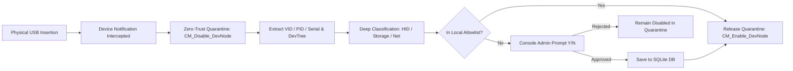
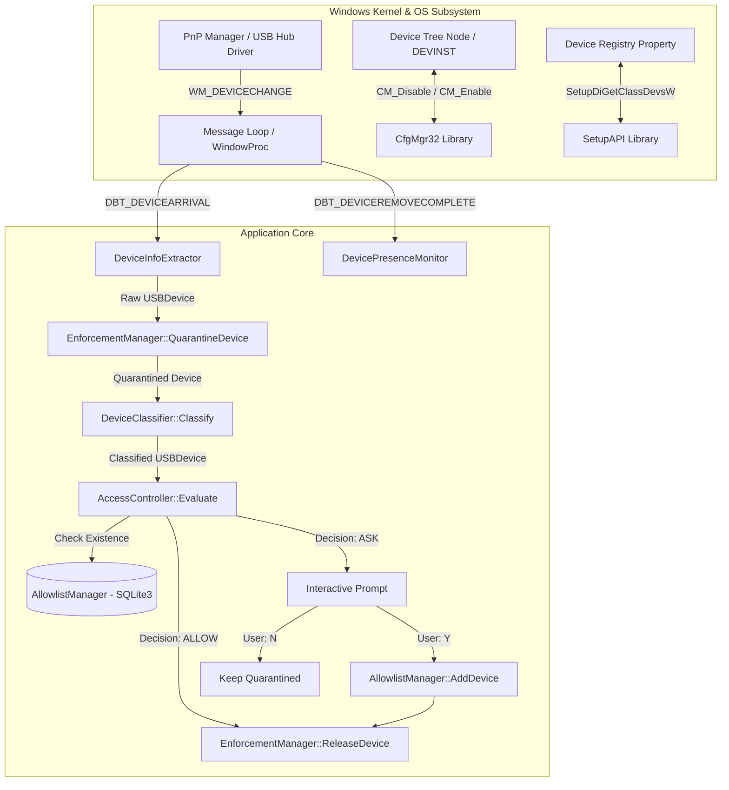
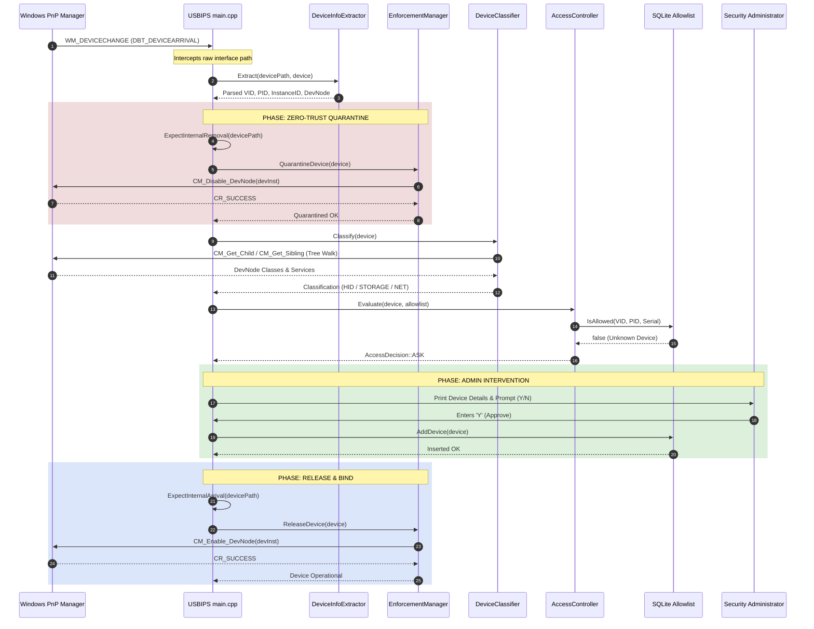
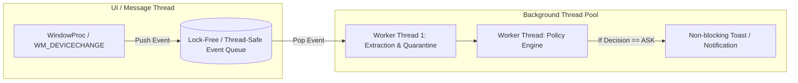
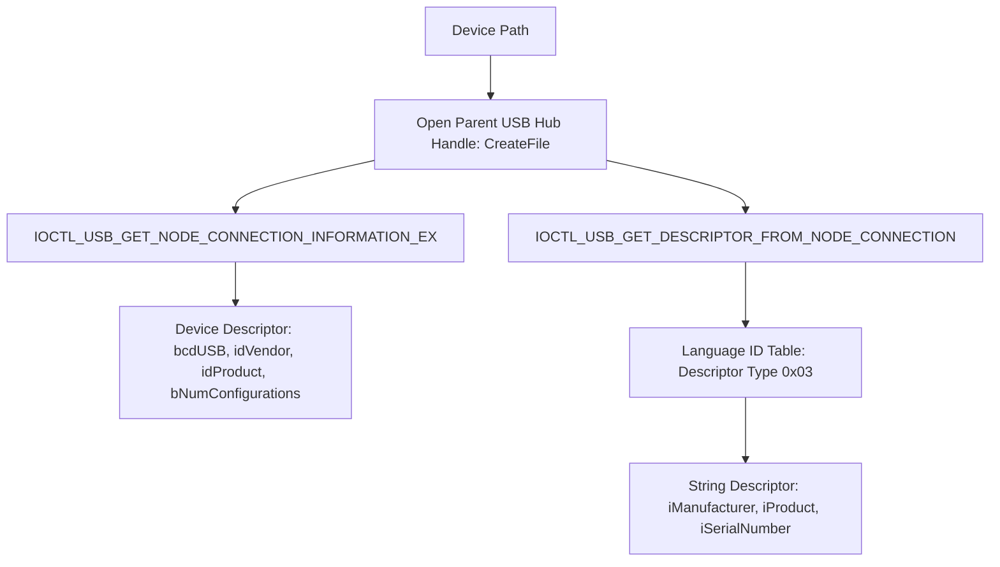
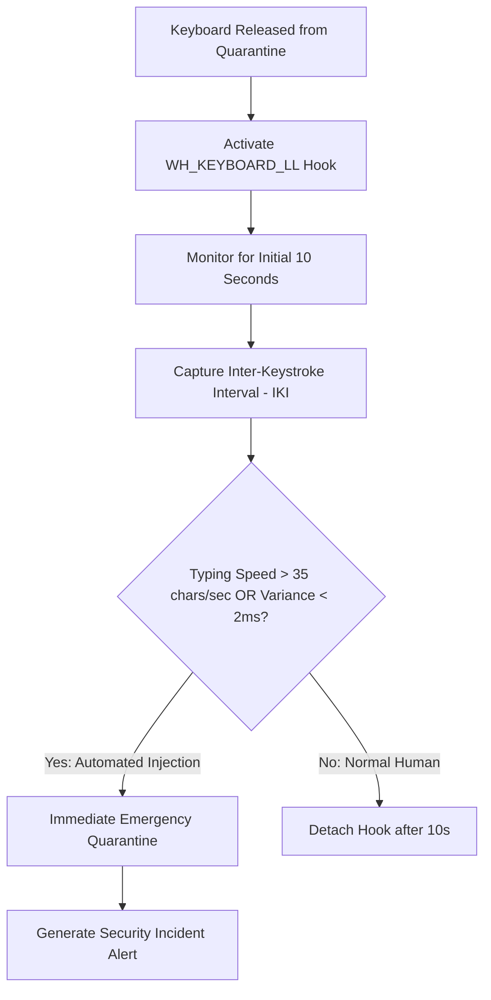
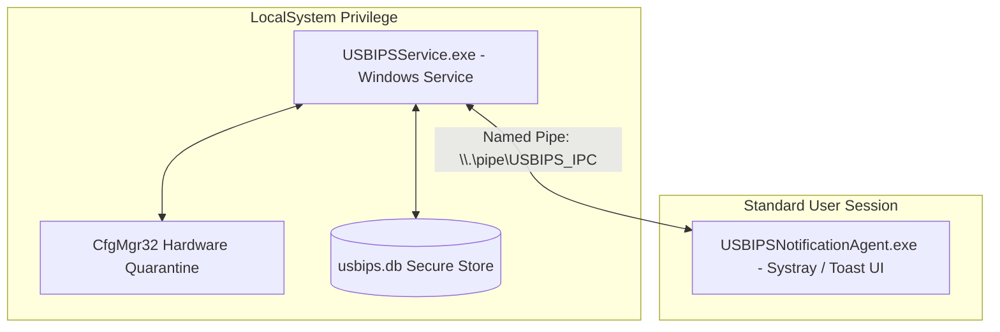

# USBIPS (USB Intrusion Prevention System) — Complete Technical Documentation & Codebase Analysis

---

## Document Metadata
- **Project Title:** USB Intrusion Prevention System (USBIPS) Client
- **Document Type:** Full System Technical Architecture, Codebase Audit & Feature Roadmap
- **Repository:** `FYP-USBIPS`
- **Language / Standards:** C++20, Win32 API, Windows Configuration Manager (`CfgMgr32`), SetupAPI, SQLite3
- **Target OS:** Windows 10 / Windows 11 (x64)
- **Document Version:** 1.0.0

---

# Table of Contents
1. [Executive Summary & Security Threat Model](#1-executive-summary--security-threat-model)
2. [High-Level Architecture & System Design](#2-high-level-architecture--system-design)
3. [Component-by-Component Technical Deep Dive](#3-component-by-component-technical-deep-dive)
   - [3.1 Application Entry & Event Loop (`main.cpp`)](#31-application-entry--event-loop-maincpp)
   - [3.2 Data Models (`Models/USBDevice.h`)](#32-data-models-modelsusbdeviceh)
   - [3.3 Metadata Extractor (`Extractor/DeviceInfoExtractor`)](#33-metadata-extractor-extractordeviceinfoextractor)
   - [3.4 Devnode Tree Classifier (`Classifier/DeviceClassifier`)](#34-devnode-tree-classifier-classifierdeviceclassifier)
   - [3.5 Persistent Allowlist Subsystem (`Allowlist/AllowlistManager`)](#35-persistent-allowlist-subsystem-allowlistallowlistmanager)
   - [3.6 Access Control Engine (`AccessControl/AccessController`)](#36-access-control-engine-accesscontrolaccesscontroller)
   - [3.7 Hardware Enforcement (`Enforcement/EnforcementManager`)](#37-hardware-enforcement-enforcementenforcementmanager)
   - [3.8 Presence & Removal Monitor (`Presence/DevicePresenceMonitor`)](#38-presence--removal-monitor-presencedevicepresencemonitor)
4. [Windows Subsystem Integration Mechanics](#4-windows-subsystem-integration-mechanics)
5. [Operational Lifecycle & State Transition Model](#5-operational-lifecycle--state-transition-model)
6. [Data Storage & Database Schema](#6-data-storage--database-schema)
7. [Comprehensive Codebase Technical Audit (Strengths & Flaws)](#7-comprehensive-codebase-technical-audit-strengths--flaws)
8. [Feature Implementation Roadmap & Engineering Blueprints](#8-feature-implementation-roadmap--engineering-blueprints)
   - [Feature 1: Non-Blocking Asynchronous Pipeline & Worker Queue](#feature-1-non-blocking-asynchronous-pipeline--worker-queue)
   - [Feature 2: Low-Level USB Descriptor Extraction via IOCTL](#feature-2-low-level-usb-descriptor-extraction-via-ioctl)
   - [Feature 3: Keystroke Injection & BadUSB Behavioral Detection](#feature-3-keystroke-injection--badusb-behavioral-detection)
   - [Feature 4: Granular Policy Engine & Read-Only USB Storage Enforcement](#feature-4-granular-policy-engine--read-only-usb-storage-enforcement)
   - [Feature 5: Windows Service Daemon + Desktop Notification Agent](#feature-5-windows-service-daemon--desktop-notification-agent)
   - [Feature 6: Security Audit Logging & SIEM Export (JSON/ETW)](#feature-6-security-audit-logging--siem-export-jsonetw)
   - [Feature 7: Interactive Allowlist CLI & Management Dashboard](#feature-7-interactive-allowlist-cli--management-dashboard)
9. [Build, Configuration, and Deployment Guide](#9-build-configuration-and-deployment-guide)

---

# 1. Executive Summary & Security Threat Model

### 1.1 Project Objective
**USBIPS (USB Intrusion Prevention System)** is an endpoint security application running on Microsoft Windows designed to enforce a **Zero-Trust hardware policy** on Universal Serial Bus (USB) peripherals. 

Standard operating systems inherently trust hardware peripherals upon connection, automatically loading vendor or generic class drivers (such as HID keyboards or Mass Storage). Adversaries exploit this implicit trust to execute physical and supply-chain attacks. USBIPS intercepts hardware connection events, captures peripheral hardware identifiers, immediately incapacitates (quarantines) the physical devnode before user-space interaction occurs, validates the peripheral against a persistent cryptographic allowlist, and only re-enables approved devices.



### 1.2 Threat Model & Targeted Attack Vectors

| Attack Vector | Mechanism | Threat Level | USBIPS Mitigation |
| :--- | :--- | :--- | :--- |
| **BadUSB / Rubber Ducky** | Microcontroller (ATmega32U4, RP2040) emulates an HID keyboard and injects high-speed malicious keystrokes to spawn shells or download payloads. | **CRITICAL** | Immediate pre-decision quarantine (`CM_Disable_DevNode`) prevents the OS from accepting keystrokes until authorization. |
| **Rogue USB Network Interface (NDIS)** | Device presents as an Ethernet/RNDIS adapter, overrides default gateway via DHCP, and hijacks/sniffs network traffic. | **HIGH** | `DeviceClassifier` inspects the devnode tree for `NET` setup classes and `NDIS` services, flagging the device. |
| **Unauthorized Data Exfiltration (Mass Storage)** | Unsanctioned USB flash drive or portable SSD attached to steal classified corporate data. | **HIGH** | Storage devices are automatically held in quarantine; unapproved drives cannot be mounted by the Windows Volume Manager. |
| **Composite / Hybrid Device Attacks** | Peripheral presents multiple interfaces (e.g., standard USB Flash drive with a covert secondary HID keyboard or cellular modem). | **CRITICAL** | `DeviceClassifier::AnalyzeChildren` recursively walks the devnode tree to detect hidden secondary classes. |
| **VID/PID Spoofing** | Adversary clones the Vendor ID and Product ID of an authorized Logitech or Dell keyboard onto a malicious device. | **HIGH** | USBIPS matches the composite tuple `(vendor_id, product_id, serial_number)`. |

---

# 2. High-Level Architecture & System Design

The USBIPS client is designed as a modular, layered C++20 architecture with direct bindings to the Win32 Configuration Manager (`CfgMgr32`), SetupAPI, and an embedded SQLite3 engine.



### Architectural Responsibilities:
1. **Event Reception (`main.cpp`):** Registers an invisible Win32 message-only window listening for `GUID_DEVINTERFACE_USB_DEVICE`.
2. **Identity Extraction (`DeviceInfoExtractor`):** Extracts Vendor ID, Product ID, instance/serial path, Friendly Name, and Hardware IDs.
3. **Hardware Enforcement (`EnforcementManager`):** Directly controls hardware driver binding by toggling device devnodes in the Windows PnP tree.
4. **Tree Classification (`DeviceClassifier`):** Recursively inspects the PnP hierarchy to detect composite functions (HID, Storage, Network).
5. **Policy & Allowlist Storage (`AccessController` & `AllowlistManager`):** Enforces 3-tuple cryptographic identity matching backed by SQLite3.
6. **Presence Verification (`DevicePresenceMonitor`):** A dedicated background thread poll-validates the physical connection state of disabled devices.

---

# 3. Component-by-Component Technical Deep Dive

### 3.1 Application Entry & Event Loop (`main.cpp`)
- **Role:** Application bootstrap, message-only window hosting, device notification registration, and orchestration of the quarantine-evaluate-release pipeline.
- **Key Implementation Details:**
  - Creates a message-only window via `CreateWindowExW` specifying `HWND_MESSAGE` as the parent. Message-only windows process messages without UI overhead or taskbar presence.
  - Calls `RegisterDeviceNotificationW` with `GUID_DEVINTERFACE_USB_DEVICE` (`{A5DCBF10-6530-11D2-901F-00C04FB951ED}`) to receive `WM_DEVICECHANGE` broadcasts.
  - **Internal Notification Echo Suppression:** Disabling (`CM_Disable_DevNode`) or enabling (`CM_Enable_DevNode`) a physical device causes Windows to generate synthetic `DBT_DEVICEREMOVECOMPLETE` and `DBT_DEVICEARRIVAL` notifications. To prevent infinite reaction loops:
    - `ExpectInternalRemoval(devicePath)` suppresses the disable echo.
    - `ExpectInternalArrival(devicePath)` suppresses the enable echo.
    - Thread safety is guarded by `g_notificationMutex`.

### 3.2 Data Models (`Models/USBDevice.h`)
Represents the in-memory state of an intercepted peripheral.
```cpp
enum class DeviceType { HID, STORAGE, NETWORK, OTHER };

struct USBDevice {
    // Identity
    std::wstring deviceInterfacePath; // Complete symbolic link from DBT_DEVICEINTERFACE
    std::wstring deviceId;            // PnP Device Instance ID (e.g., USB\VID_xxxx&PID_xxxx\serial)
    std::wstring vendorId;            // 4-character hex VID
    std::wstring productId;           // 4-character hex PID
    std::wstring productRevision;     // Revision tag
    std::wstring serialNumber;        // Extracted serial number or instance hash

    // Windows PnP Properties
    std::wstring description;         // SPDRP_DEVICEDESC
    std::wstring manufacturer;        // SPDRP_MFG
    std::wstring hardwareIds;         // SPDRP_HARDWAREID

    // Deep Classification
    DeviceType type = DeviceType::OTHER;
    bool hasHID = false;
    bool hasStorage = false;
    bool hasNetwork = false;
    std::vector<std::wstring> detectedClasses;
};
```

### 3.3 Metadata Extractor (`Extractor/DeviceInfoExtractor`)
- **Role:** Transforms the raw device interface path string into structured device identifiers.
- **Methods:**
  - `Extract(const std::wstring& devicePath, USBDevice& device)`: Orchestrates regex parsing and SetupAPI device queries.
  - `ExtractVidPid(...)`: Applies regular expression `L"VID_([0-9A-Fa-f]{4})&PID_([0-9A-Fa-f]{4})"` to extract hardware IDs.
  - `ExtractInstancePart(...)`: Extracts the third delimited substring between hash (`#`) characters representing the device instance or serial number.
  - `FindDeviceByInterfacePath(...)`: Queries `SetupDiGetClassDevsW` with `DIGCF_PRESENT | DIGCF_DEVICEINTERFACE`, iterates via `SetupDiEnumDeviceInterfaces`, and resolves the underlying `SP_DEVINFO_DATA`.
  - `GetDeviceProperty(...)`: Fetches registry properties (`SPDRP_DEVICEDESC`, `SPDRP_MFG`, `SPDRP_HARDWAREID`) using `SetupDiGetDeviceRegistryPropertyW`.
  - `SetupDiGetDeviceInstanceIdW`: Obtains the canonical system `deviceId` (essential for `CM_Locate_DevNodeW`).

### 3.4 Devnode Tree Classifier (`Classifier/DeviceClassifier`)
- **Role:** Deep physical analysis of the PnP device hierarchy. A single physical USB device can spawn multiple child nodes (e.g., a composite device exposing both a mass-storage controller and a virtual keyboard).
- **Core Algorithms:**
  - `AnalyzeDeviceTree(USBDevice& device)`: Calls `CM_Locate_DevNodeW` using `device.deviceId` to acquire the root `DEVINST` handle.
  - `AnalyzeChildren(DEVINST parent, USBDevice& device, int depth)`: Traverses child nodes via `CM_Get_Child` and horizontal siblings via `CM_Get_Sibling` (bounded by a recursion safety ceiling of `depth > 20`).
  - `AnalyzeDevNode(DEVINST devInst, USBDevice& device)`: Reads `CM_DRP_CLASS` and `CM_DRP_SERVICE` properties:
    - **HID Detection:** Class equals `HIDCLASS`, ID prefix `HID\`, or Service `HIDUSB`.
    - **Storage Detection:** Class equals `USBSTOR`, `DISKDRIVE`, `VOLUME`, ID prefix `USBSTOR\`, or Service `USBSTOR`.
    - **Network Detection:** Class equals `NET`, ID prefix `ROOT\NET`, or Service `NDIS`.
  - Determines composite classification: if multiple capabilities are flagged, sets `DeviceType::OTHER` and lists individual capabilities.

### 3.5 Persistent Allowlist Subsystem (`Allowlist/AllowlistManager`)
- **Role:** SQLite-backed cryptographic store for trusted hardware definitions.
- **Database Engine:** Bundled SQLite 3 amalgamation (`ThirdParty/SQLite/sqlite3.c`), compiled directly with C-linkage.
- **Key Operations:**
  - `Initialize(databasePath)`: Opens the SQLite database via `sqlite3_open16` and creates the `allowed_devices` table if it does not exist.
  - `IsAllowed(device)`: Prepares query `SELECT COUNT(*) FROM allowed_devices WHERE vendor_id = ? AND product_id = ? AND serial_number = ?;`. Uses UTF-16 parameter binding (`sqlite3_bind_text16`).
  - `AddDevice(device)`: Executes parameterized `INSERT OR IGNORE INTO allowed_devices` storing identity attributes and timestamps.
  - `RemoveDevice(device)`: Removes devices by composite tuple match.
  - `GetAllDevices()`: Returns all enrolled records for auditing and management.

### 3.6 Access Control Engine (`AccessControl/AccessController`)
- **Role:** Policy evaluation abstraction layer.
- **Decisions:**
  - `AccessDecision::ALLOW`: Device matches an enrolled allowlist tuple.
  - `AccessDecision::BLOCK`: Explicitly rejected or policy violation.
  - `AccessDecision::ASK`: Device unknown; administrator interactive intervention required.

### 3.7 Hardware Enforcement (`Enforcement/EnforcementManager`)
- **Role:** Low-level PnP hardware driver decoupling and re-binding.
- **APIs Used:** `cfgmgr32.lib` (`CM_Locate_DevNodeW`, `CM_Disable_DevNode`, `CM_Enable_DevNode`).
- **Quarantine Logic (`QuarantineDevice`):**
  - Obtains fresh `DEVINST` handle via `CM_Locate_DevNodeW`.
  - Invokes `CM_Disable_DevNode(devInst, CM_DISABLE_UI_NOT_OK)`.
  - **Veto Retry Loop:** When a device is freshly inserted, Windows driver installation or mount manager may hold an exclusive lock, causing `CM_Disable_DevNode` to return `CR_REMOVE_VETOED`. The engine incorporates a 5-attempt retry loop with `Sleep(300)` backoff.
- **Release Logic (`ReleaseDevice`):**
  - Calls `CM_Enable_DevNode(devInst, 0)`. Windows automatically reattaches the driver stack and mounts storage volumes or HID input listeners.

### 3.8 Presence & Removal Monitor (`Presence/DevicePresenceMonitor`)
- **Role:** Detects physical removal of quarantined devices.
- **Problem Solved:** When a device is disabled via `CM_Disable_DevNode`, Windows stops sending standard `DBT_DEVICEREMOVECOMPLETE` broadcast messages when the physical cable is pulled out. Without this component, unapproved devices would remain registered in internal tracking indefinitely.
- **Mechanism:**
  - Spawns a background thread `m_monitorThread` executing `MonitorLoop()`.
  - Polls `CM_Locate_DevNodeW` every 500ms for all devices in `g_trackedDevices`.
  - Incorporates a 2-second initial grace period to avoid false positives during driver disablement transitions.
  - Enforces a 2-consecutive-failure debounce counter before declaring the device physically detached.

---

# 4. Windows Subsystem Integration Mechanics



---

# 5. Operational Lifecycle & State Transition Model

```
                    ┌─────────────────────────┐
                    │      DISCONNECTED       │
                    └────────────┬────────────┘
                                 │
                     Physical USB Insertion
                     [DBT_DEVICEARRIVAL]
                                 ▼
                    ┌─────────────────────────┐
                    │   EXTRACTING IDENTITY   │
                    └────────────┬────────────┘
                                 │
                     SetupAPI & RegEx Success
                                 ▼
                    ┌─────────────────────────┐
                    │  IMMEDIATE QUARANTINE   │ ◄─── Zero-Trust Boundary
                    │  (CM_Disable_DevNode)   │
                    └────────────┬────────────┘
                                 │
                     DevNode Tree Walk Success
                                 ▼
                    ┌─────────────────────────┐
                    │    CLASSIFIED DEVICE    │
                    └────────────┬────────────┘
                                 │
                     Allowlist Evaluation Check
                                 │
                ┌────────────────┴────────────────┐
                ▼                                 ▼
        [Already Allowed]                  [Not in Allowlist]
                │                                 ▼
                │                       ┌───────────────────┐
                │                       │  AWAITING DECISION│
                │                       │    (User Prompt)  │
                │                       └─────────┬─────────┘
                │                                 │
                │                        ┌────────┴────────┐
                │                        ▼                 ▼
                │                  [User Approves]   [User Denies]
                │                        ▼                 ▼
                │                ┌──────────────┐   ┌──────────────┐
                │                │ Saved to DB  │   │   BLOCKED    │
                │                └───────┬──────┘   │  (Permanent  │
                │                        │          │  Quarantine) │
                ├────────────────────────┘          └──────────────┘
                ▼
    ┌─────────────────────────┐
    │    RELEASE QUARANTINE   │
    │   (CM_Enable_DevNode)   │
    └───────────┬─────────────┘
                │
                ▼
    ┌─────────────────────────┐
    │     DEVICE ACTIVE &     │
    │       OPERATIONAL       │
    └─────────────────────────┘
```

---

# 6. Data Storage & Database Schema

The allowlist is stored locally using SQLite 3. The file `usbips.db` is managed in the application's active working directory.

### Table: `allowed_devices`

```sql
CREATE TABLE IF NOT EXISTS allowed_devices
(
    id INTEGER PRIMARY KEY AUTOINCREMENT,
    vendor_id TEXT NOT NULL,
    product_id TEXT NOT NULL,
    serial_number TEXT NOT NULL,
    device_type TEXT,
    description TEXT,
    manufacturer TEXT,
    created_at DATETIME DEFAULT CURRENT_TIMESTAMP,
    UNIQUE(vendor_id, product_id, serial_number)
);
```

### Column Specifications:
- `id`: Auto-incrementing surrogate primary key.
- `vendor_id`: 4-character uppercase hexadecimal USB Vendor ID (e.g., `"046D"`).
- `product_id`: 4-character uppercase hexadecimal USB Product ID (e.g., `"C077"`).
- `serial_number`: Extracted USB serial number string or device instance component.
- `device_type`: High-level classification label (`"HID"`, `"STORAGE"`, `"NETWORK"`, `"OTHER"`).
- `description`: Windows descriptive string (`SPDRP_DEVICEDESC`).
- `manufacturer`: Vendor manufacturer string (`SPDRP_MFG`).
- `created_at`: UTC timestamp of enrollment.
- `UNIQUE(vendor_id, product_id, serial_number)`: Compound unique constraint preventing duplicate device records and allowing fast index lookups.

---

# 7. Comprehensive Codebase Technical Audit (Strengths & Flaws)

A rigorous review of the current Phase 1 codebase reveals significant architectural strengths alongside critical security and operational limitations that must be solved in future phases.

### 7.1 Core Strengths
1. **Pre-Decision Quarantine (Zero-Trust):** By invoking `CM_Disable_DevNode` *before* evaluating the allowlist or presenting the prompt, the system neutralizes BadUSB attacks that inject keystrokes within milliseconds of insertion.
2. **Devnode Tree Traversal:** Inspecting parent, child, and sibling devnodes using `CM_Get_Child` and `CM_Get_Sibling` ensures that composite devices (e.g., flash drive + hidden keyboard) cannot bypass classification.
3. **Echo Suppression Mechanism:** The hash-set based tracking of expected arrivals and removals effectively prevents infinite event loops triggered by Windows Configuration Manager state changes.
4. **Self-Contained Embedded Persistence:** Statically linking SQLite eliminating external runtime dependencies or server configurations.

### 7.2 Critical Limitations, Bugs, and Technical Gaps

#### Bug 1: UI Blocking / Message Loop Starvation (`main.cpp`)
- **Vulnerability:** The console prompt `std::wcin >> answer` is executed directly inside the `WindowProc` callback on the thread hosting the Win32 message loop (`GetMessageW`).
- **Impact:** While waiting for console input, the entire Windows message queue is frozen. Any subsequent USB arrivals or removals are blocked, resulting in dropped events, unresponsive OS notifications, and race conditions.

#### Bug 2: Multi-String Registry Property Extraction Failure (`DeviceInfoExtractor.cpp`)
- **Vulnerability:** In `GetDeviceProperty(...)`:
  ```cpp
  if (dataType == REG_SZ || dataType == REG_EXPAND_SZ) {
      return std::wstring(reinterpret_cast<wchar_t*>(buffer.data()));
  }
  ```
  In Windows, `SPDRP_HARDWAREID` is *always* stored as `REG_MULTI_SZ` (a sequence of null-terminated strings ending with double null). 
- **Impact:** Because `REG_MULTI_SZ` is not checked, `GetDeviceProperty` returns an empty string `L""` for all hardware IDs.

#### Vulnerability 3: Synthetic / Volatile Instance ID Used as Serial Number
- **Vulnerability:** `ExtractInstancePart` extracts the third token from the device interface path. For USB devices lacking an internal hardware serial number, the Windows USB hub driver synthesizes a volatile instance ID based on hub port topology (e.g., `6&2a3b4c5d&0&1`).
- **Impact:** If a legitimate device without a hardware serial is plugged into a different USB port, its generated instance ID changes. The device fails allowlist matching and is blocked. Conversely, an attacker can exploit predictable port numbering to spoof an allowed slot.

#### Limitation 4: Monolithic Process Lacking Privilege Separation
- **Vulnerability:** The entire application (message loop, UI prompt, database I/O, and driver management) runs as a single elevated Administrator process in a console window.
- **Impact:** If terminated or closed accidentally, quarantine enforcement ceases, and existing disabled devices cannot be recovered automatically. Furthermore, enterprise users cannot run console prompts under non-admin accounts.

#### Limitation 5: Lack of Granular Policy Definitions
- **Vulnerability:** Access control is strictly binary (allow or block) based on exact 3-tuple match.
- **Impact:** Administrators cannot define rule-based policies such as:
  - "Allow all standard HID mice and keyboards from certified vendors."
  - "Allow USB storage devices in Read-Only mode."
  - "Permanently blacklist all USB network adapters."

---

# 8. Feature Implementation Roadmap & Engineering Blueprints

To evolve USBIPS from a prototype into a production-grade enterprise intrusion prevention system, the following modular enhancements must be implemented.

---

## Feature 1: Non-Blocking Asynchronous Pipeline & Worker Queue

### Objective
Decouple `WindowProc` message dispatching from device extraction, quarantine enforcement, database queries, and administrator interaction.

### Architecture Design


### Implementation Blueprint
1. Implement a thread-safe task queue `DeviceEventQueue` with condition variables:
   ```cpp
   struct DeviceArrivalTask {
       std::wstring deviceInterfacePath;
       std::chrono::steady_clock::time_point timestamp;
   };
   ```
2. In `WindowProc`, immediately enqueue the interface path and return `0` within microseconds:
   ```cpp
   case WM_DEVICECHANGE:
       if (wParam == DBT_DEVICEARRIVAL) {
           // Quick filter & push to queue
           g_eventQueue.Push({ deviceInterface->dbcc_name, std::chrono::steady_clock::now() });
           return TRUE;
       }
   ```
3. A dedicated `WorkerPool` processes extraction, quarantine, and classification asynchronously without dropping kernel device notifications.

---

## Feature 2: Low-Level USB Descriptor Extraction via IOCTL

### Objective
Query true hardware descriptors directly from the parent USB Hub controller via `DeviceIoControl` rather than relying on synthetic registry strings.



### Win32 IOCTL Implementation Specifications
- **Header Requirements:** `#include <usbioctl.h>`, `#include <usb.h>`
- **Sequence:**
  1. Parse port number from device location information (`SPDRP_LOCATION_INFORMATION`).
  2. Open handle to parent hub using `CreateFileW(hubPath, GENERIC_READ | GENERIC_WRITE, FILE_SHARE_READ | FILE_SHARE_WRITE, ...)`
  3. Send `IOCTL_USB_GET_NODE_CONNECTION_INFORMATION_EX` to extract:
     - USB speed (`UsbLowSpeed`, `UsbFullSpeed`, `UsbHighSpeed`, `UsbSuperSpeed`).
     - Connection status and Device Descriptor (`USB_DEVICE_DESCRIPTOR`).
  4. Query String Descriptors via `IOCTL_USB_GET_DESCRIPTOR_FROM_NODE_CONNECTION`:
     - Request Index `Descriptor.iSerialNumber` to retrieve genuine hardware serials stored on the USB peripheral EEPROM.

---

## Feature 3: Keystroke Injection & BadUSB Behavioral Detection

### Objective
Defend against authorized or cloned keyboards executing automated Rubber Ducky payload scripts (superhuman typing bursts immediately upon release).



### Technical Specification
1. When a device with `hasHID == true` is released, start an anomaly surveillance window (e.g., first 10 seconds or first 100 keystrokes).
2. Install low-level keyboard hook via `SetWindowsHookExW(WH_KEYBOARD_LL, LowLevelKeyboardProc, hInstance, 0)`.
3. In `LowLevelKeyboardProc`:
   - Calculate Inter-Keystroke Interval: $\Delta t = t_n - t_{n-1}$.
   - Human typing cadence displays statistical variance ($\sigma > 25\text{ ms}$) and average rates $< 12\text{ characters/sec}$.
   - Hardware injection tools (Rubber Ducky, Flipper Zero, Teensy) fire keystrokes at fixed intervals ($\Delta t \approx 1\text{ to }5\text{ ms}$, $\sigma \to 0$).
4. If burst anomaly is detected:
   - Suppress keystroke (`return 1` to drop event from OS input buffer).
   - Instantly invoke `EnforcementManager::QuarantineDevice(device)`.
   - Blacklist device in SQLite database with threat flag `BADUSB_INJECTION_DETECTED`.

---

## Feature 4: Granular Policy Engine & Read-Only USB Storage Enforcement

### Objective
Replace binary allowlisting with an enterprise rule engine supporting class-level permissions, vendor rules, and storage write-protection.

### Policy Rules Schema (`policies.json` or Database Table `policies`)
```json
{
  "rules": [
    {
      "name": "Allow Corporate HID Mice & Keyboards",
      "device_type": "HID",
      "action": "ALLOW",
      "match": {
        "vendor_id": "046D" 
      }
    },
    {
      "name": "Enforce Read-Only on Storage",
      "device_type": "STORAGE",
      "action": "ENFORCE_READ_ONLY"
    },
    {
      "name": "Block All USB Network Adapters",
      "device_type": "NETWORK",
      "action": "BLOCK"
    }
  ]
}
```

### Read-Only Storage Enforcement Mechanism
Windows supports kernel-level storage write protection via the Windows Registry key:
`HKEY_LOCAL_MACHINE\SYSTEM\CurrentControlSet\Control\StorageDevicePolicies`
- **Value:** `WriteProtect = 1` (DWORD).
- When a storage device is approved under `ENFORCE_READ_ONLY`, USBIPS sets `WriteProtect` before invoking `CM_Enable_DevNode`. The Windows Storage Stack mounts partitions as read-only, preventing data exfiltration while permitting document reading.

---

## Feature 5: Windows Service Daemon + Desktop Notification Agent

### Objective
Split USBIPS into a high-integrity background service running under `NT AUTHORITY\SYSTEM` and a non-elevated user desktop client.



### IPC Protocol (Named Pipes)
- Service creates secure named pipe `\\.\pipe\USBIPS_IPC` with explicit Security Descriptor (`DACL` allowing standard users read/write, administrators full control).
- Upon device arrival, Service quarantines hardware, analyzes the tree, and sends a JSON payload across the pipe:
  ```json
  {
    "event": "DEVICE_APPROVAL_REQUEST",
    "device_id": "USB\\VID_0781&PID_5583\\4C530001",
    "vendor": "SanDisk",
    "type": "STORAGE"
  }
  ```
- User agent displays a native Windows 10/11 Toast Notification with interactive **Approve** and **Deny** buttons.
- User selection is transmitted back through the pipe to the Service for database commitment and hardware release.

---

## Feature 6: Security Audit Logging & SIEM Export (JSON/ETW)

### Objective
Maintain forensic audit trails compliant with cybersecurity monitoring frameworks (MITRE ATT&CK for Enterprise: Physical Access).

### Audit Table Schema
```sql
CREATE TABLE IF NOT EXISTS audit_logs (
    log_id INTEGER PRIMARY KEY AUTOINCREMENT,
    timestamp DATETIME DEFAULT CURRENT_TIMESTAMP,
    event_type TEXT NOT NULL,         -- 'ARRIVAL', 'QUARANTINE', 'APPROVAL', 'BLOCK', 'REMOVAL'
    vendor_id TEXT,
    product_id TEXT,
    serial_number TEXT,
    device_type TEXT,
    enforcement_status TEXT,          -- 'SUCCESS', 'VETOED', 'FAILED'
    action_taken TEXT,                -- 'ALLOWED_AUTOMATIC', 'ALLOWED_ADMIN', 'BLOCKED_POLICY'
    details TEXT
);
```

### Windows Event Log / ETW Provider
- Register a custom ETW Provider (`Provider GUID: {B3F4A7B2-...}`) or write to the Windows Application Log via `ReportEventW`.
- SOC / SIEM agents (Splunk Universal Forwarder, Wazuh, Microsoft Defender for Endpoint) ingest event IDs (e.g., `EventID 1001: Device Quarantined`, `EventID 1002: Unknown USB Blocked`).

---

## Feature 7: Interactive Allowlist CLI & Management Dashboard

### Objective
Provide administrator tools to audit, list, export, and revoke enrollments without manual SQLite database manipulation.

### Proposed CLI Interface
```text
usbips-cli.exe --list                     # Tabulate all allowed devices
usbips-cli.exe --remove <id>              # Revoke device authorization by ID
usbips-cli.exe --export <path.json>       # Export allowlist policy
usbips-cli.exe --import <path.json>       # Import fleetwide allowlist
usbips-cli.exe --logs --tail 50           # View real-time security events
```

---

# 9. Build, Configuration, and Deployment Guide

### 9.1 Environment & Toolchain Prerequisites
- **Operating System:** Windows 10 (Build 19041+) or Windows 11 (x64)
- **IDE:** Visual Studio Community 2022 / 2026
- **Workload:** *Desktop development with C++*
- **Toolset:** MSVC `v143` or `v145`
- **C++ Standard:** ISO C++20 Standard (`/std:c++20`)
- **Character Set:** Unicode (`/DUNICODE /D_UNICODE`)
- **Required Libraries:**
  - `setupapi.lib` (linked via `#pragma comment(lib, "setupapi.lib")`)
  - `cfgmgr32.lib` (linked via `#pragma comment(lib, "cfgmgr32.lib")`)
  - `sqlite3` (bundled source under `ThirdParty/SQLite/sqlite3.c`)

### 9.2 Developer CLI Build
Open **Developer Command Prompt for Visual Studio** as Administrator and execute:
```cmd
cd E:\FYP-USBIPS
msbuild USBIPSClient.slnx /m /p:Configuration=Debug /p:Platform=x64
```

### 9.3 Runtime Execution Instructions
```cmd
:: Ensure current directory is repository root so usbips.db is located properly
cd E:\FYP-USBIPS
x64\Debug\USBIPSClient.exe
```

> [!IMPORTANT]
> **Privilege Elevation:** `CM_Disable_DevNode` and `CM_Enable_DevNode` strictly fail with `CR_ACCESS_DENIED` unless the executable process holds elevated administrator privileges. Always execute from an elevated command prompt or launch Visual Studio via **Run as Administrator**.
