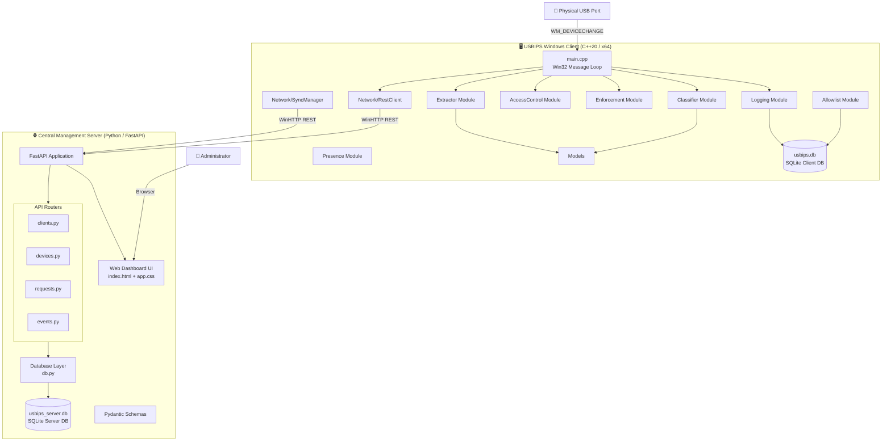
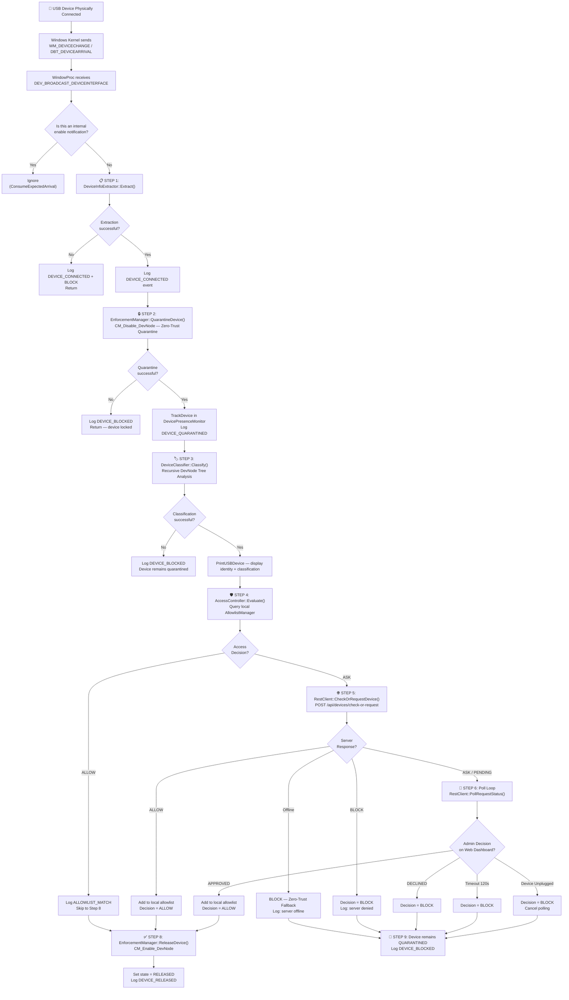
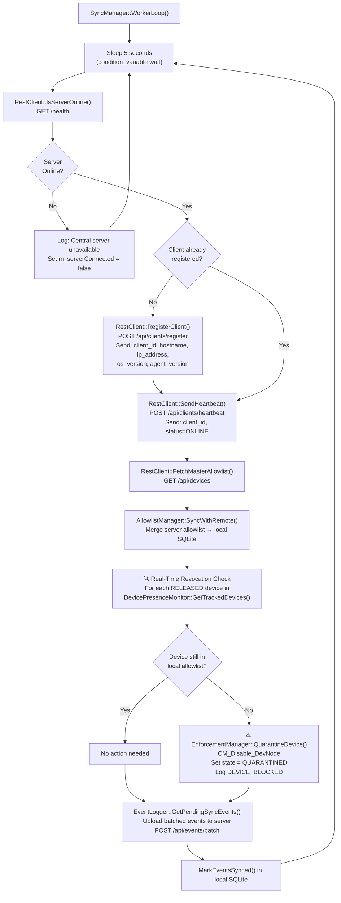
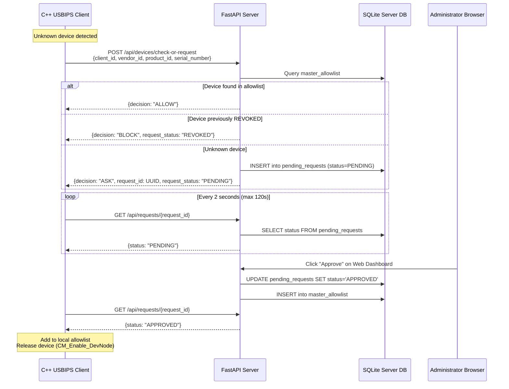
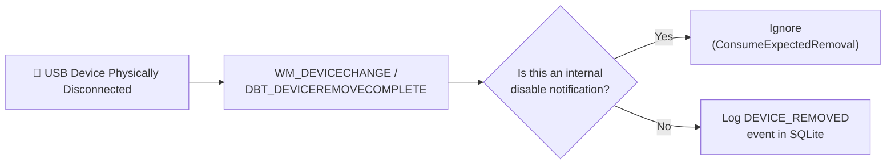
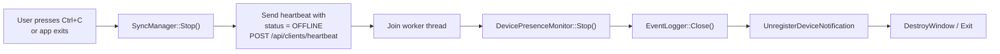
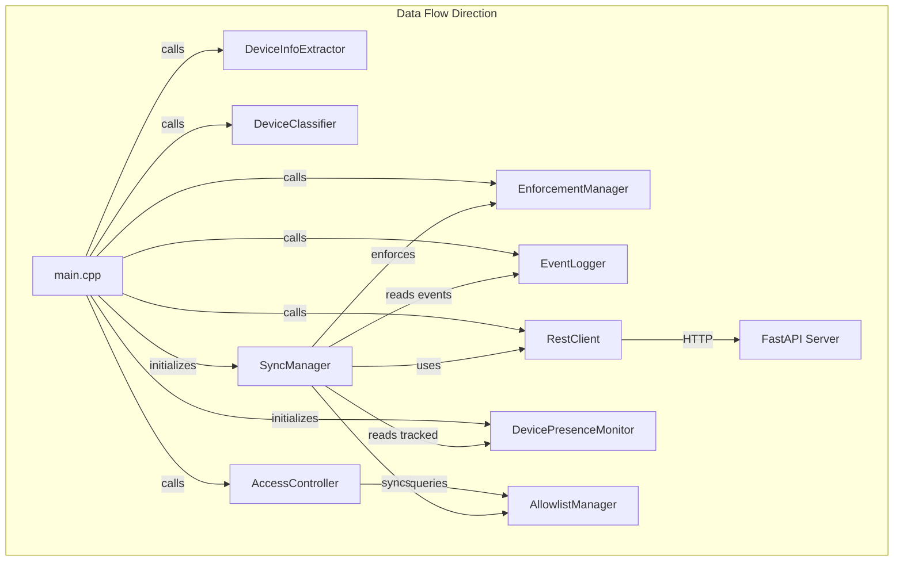

# USBIPS System — Detailed Design Document

> **USB Intrusion Prevention System (USBIPS)** — Phase 1 Architecture, Process Diagrams, and Module Specifications

---

## 1. High-Level System Architecture

---

## 2. Process Flow Diagrams

### 2.1 Master Process Flow — USB Device Detection Pipeline

This is the complete end-to-end processing pipeline that executes when a USB device is physically connected to the Windows endpoint.

---

### 2.2 Background Sync Engine — SyncManager Periodic Cycle

This process runs on an independent background thread every 5 seconds, independent of the USB detection pipeline above.

---

### 2.3 Server-Side Request Lifecycle — Approval / Decline Flow

---

### 2.4 USB Device Removal Flow

---

### 2.5 Graceful Client Shutdown Flow

---

## 3. Module Detailed Specifications

### 3.1 Models Module

| File | Purpose |
|---|---|
| [USBDevice.h](file:///e:/FYP-USBIPS/Models/USBDevice.h) | Core data structure representing a USB peripheral |
| [SecurityEvent.h](file:///e:/FYP-USBIPS/Models/SecurityEvent.h) | Security audit event structure + event type enumeration |

#### Sub-components

**`USBDevice` struct** — Represents a single USB peripheral with three data regions:

| Field Group | Fields | Description |
|---|---|---|
| **Identity** | `deviceInterfacePath`, `deviceId`, `vendorId`, `productId`, `productRevision`, `serialNumber` | Hardware identity extracted from Windows device path and SetupAPI |
| **Windows Info** | `description`, `manufacturer`, `hardwareIds` | Human-readable properties from Windows device registry |
| **Classification** | `type` (DeviceType enum), `hasHID`, `hasStorage`, `hasNetwork`, `detectedClasses` | Results of recursive DevNode tree analysis |

**`DeviceType` enum** — `HID`, `STORAGE`, `NETWORK`, `OTHER`

**`SecurityEventType` enum** — `DEVICE_CONNECTED`, `DEVICE_QUARANTINED`, `DEVICE_RELEASED`, `DEVICE_REMOVED`, `ALLOWLIST_MATCH`, `UNKNOWN_DEVICE`, `USER_APPROVED`, `USER_REJECTED`, `DEVICE_BLOCKED`

**`SecurityEvent` struct** — Audit record with fields: `eventId`, `clientId`, `timestamp`, `eventType`, device identity fields, `decision`, `reason`, `syncStatus` (PENDING/SYNCED).

---

### 3.2 Presence Module — Device Presence Monitor

| File | Purpose |
|---|---|
| [DevicePresenceMonitor.h](file:///e:/FYP-USBIPS/Presence/DevicePresenceMonitor.h) | Header with tracking state machine and API |
| [DevicePresenceMonitor.cpp](file:///e:/FYP-USBIPS/Presence/DevicePresenceMonitor.cpp) | Implementation of background presence polling loop |

**Purpose**: Continuously tracks which USB devices are physically connected and their quarantine/release state. Enables the SyncManager to detect real-time revocations and the approval polling loop to detect unplugged devices.

#### Sub-components

| Sub-component | Type | Description |
|---|---|---|
| **`DeviceTrackingState`** | Enum | `QUARANTINED` — device is disabled via CM_Disable_DevNode; `RELEASED` — device is enabled and active |
| **`TrackedDevice`** | Struct | Holds `deviceId`, `deviceInterfacePath`, full `USBDevice` copy, `state`, `trackingStart` timestamp, `missingChecks` counter |
| **`g_trackedDevices`** | Static vector | In-memory registry of all currently tracked USB peripherals |
| **`MonitorLoop()`** | Private method | Background thread that periodically (every 2s) polls `CM_Locate_DevNodeW` to verify each tracked device is still physically present. Increments `missingChecks` if device node cannot be located |
| **`TrackDevice()`** | Public method | Adds a newly detected USB device to the tracked list (called after quarantine in main pipeline) |
| **`SetDeviceState()`** | Public method | Transitions a device between `QUARANTINED` ↔ `RELEASED` (called after approval or revocation) |
| **`UntrackDevice()`** | Public method | Removes a device from tracking on physical disconnection |
| **`IsDevicePresent()`** | Public method | Real-time check if a device node still exists via `CM_Locate_DevNodeW`. Used during approval polling to cancel if user unplugs |
| **`GetTrackedDevices()`** | Public method | Returns snapshot of all tracked devices. Used by SyncManager for revocation enforcement scanning |

**Thread Safety**: All access to `g_trackedDevices` is protected by `g_mutex`.

---

### 3.3 Extractor Module — Device Info Extractor

| File | Purpose |
|---|---|
| [DeviceInfoExtractor.h](file:///e:/FYP-USBIPS/Extractor/DeviceInfoExtractor.h) | Static class with Extract, VID/PID parsing, instance extraction |
| [DeviceInfoExtractor.cpp](file:///e:/FYP-USBIPS/Extractor/DeviceInfoExtractor.cpp) | SetupAPI-based device property extraction |

**Purpose**: Takes a raw Windows device interface path (received from `WM_DEVICECHANGE`) and populates a `USBDevice` struct with all identity and metadata fields.

#### Sub-components

| Sub-component | Visibility | Description |
|---|---|---|
| **`Extract()`** | Public | Main entry point. Takes `devicePath` string, returns populated `USBDevice`. Orchestrates all sub-extractors below |
| **`ExtractVidPid()`** | Private | Parses the device path using regex pattern `VID_([0-9A-Fa-f]{4})&PID_([0-9A-Fa-f]{4})` to extract Vendor ID and Product ID |
| **`ExtractInstancePart()`** | Private | Tokenizes the device path by `#` delimiters to extract the serial number / instance component (third segment) |
| **`FindDeviceByInterfacePath()`** | File-local | Enumerates all USB device interfaces via `SetupDiGetClassDevsW` + `SetupDiEnumDeviceInterfaces`, matches the target path using case-insensitive comparison, returns the `SP_DEVINFO_DATA` handle |
| **`GetDeviceProperty()`** | File-local | Queries Windows device registry properties via `SetupDiGetDeviceRegistryPropertyW`. Extracts: `SPDRP_DEVICEDESC` (description), `SPDRP_MFG` (manufacturer), `SPDRP_HARDWAREID` (hardware IDs) |

**Windows APIs Used**: `setupapi.h`, `SetupDiGetClassDevsW`, `SetupDiEnumDeviceInterfaces`, `SetupDiGetDeviceInterfaceDetailW`, `SetupDiGetDeviceRegistryPropertyW`, `SetupDiGetDeviceInstanceIdW`

---

### 3.4 Classifier Module — Device Classifier

| File | Purpose |
|---|---|
| [DeviceClassifier.h](file:///e:/FYP-USBIPS/Classifier/DeviceClassifier.h) | Static class with Classify and device tree analysis |
| [DeviceClassifier.cpp](file:///e:/FYP-USBIPS/Classifier/DeviceClassifier.cpp) | Recursive PnP device tree walker for multi-interface classification |

**Purpose**: Determines the functional category (HID, STORAGE, NETWORK, or OTHER) of a USB device by recursively walking its Windows Plug-and-Play device tree and analyzing child node classes and driver services.

#### Sub-components

| Sub-component | Visibility | Description |
|---|---|---|
| **`Classify()`** | Public | Main entry point. Resets classification flags, calls `AnalyzeDeviceTree()`, then determines the primary `DeviceType` based on detected capabilities. If exactly one capability flag is set → assigns that type. If multiple or zero → assigns `OTHER` |
| **`AnalyzeDeviceTree()`** | Private | Locates the root device node via `CM_Locate_DevNodeW`, analyzes it, then recurses into all children |
| **`AnalyzeDevNode()`** | File-local | For a single device node, reads `CM_DRP_CLASS` (class name), `CM_DRP_SERVICE` (driver service), and instance ID. Then calls the three classification detectors below |
| **`AnalyzeChildren()`** | File-local | Recursive depth-first traversal of PnP device tree using `CM_Get_Child` / `CM_Get_Sibling`. Depth limit = 20 |
| **`IsHIDClass()`** | File-local | Returns true if class = `HIDCLASS`, instance starts with `HID\\`, or service = `HIDUSB` |
| **`IsStorageClass()`** | File-local | Returns true if class ∈ {`USBSTOR`, `DISKDRIVE`, `VOLUME`}, instance starts with `USBSTOR\\`, or service = `USBSTOR` |
| **`IsNetworkClass()`** | File-local | Returns true if class = `NET`, instance starts with `ROOT\NET`, or service = `NDIS` |
| **`GetDevNodeProperty()`** | File-local | Reads a registry property from a `DEVINST` handle via `CM_Get_DevNode_Registry_PropertyW` |
| **`GetDevNodeInstanceId()`** | File-local | Retrieves device instance ID string via `CM_Get_Device_IDW` |

**Windows APIs Used**: `cfgmgr32.h`, `CM_Locate_DevNodeW`, `CM_Get_Child`, `CM_Get_Sibling`, `CM_Get_DevNode_Registry_PropertyW`, `CM_Get_Device_IDW`

---

### 3.5 Allowlist Module — Allowlist Manager

| File | Purpose |
|---|---|
| [AllowlistManager.h](file:///e:/FYP-USBIPS/Allowlist/AllowlistManager.h) | Class definition with SQLite handle and thread-safe mutex |
| [AllowlistManager.cpp](file:///e:/FYP-USBIPS/Allowlist/AllowlistManager.cpp) | SQLite CRUD operations for the local `allowed_devices` table |

**Purpose**: Manages the client-side local allowlist stored in SQLite (`usbips.db`). Provides fast local lookup for access-control decisions and supports server-driven allowlist synchronization.

#### Sub-components

| Sub-component | Visibility | Description |
|---|---|---|
| **`Initialize()`** | Public | Opens/creates the SQLite database file, calls `CreateTables()` to ensure schema exists |
| **`CreateTables()`** | Private | Creates `allowed_devices` table with columns: `id`, `vendor_id`, `product_id`, `serial_number`, `device_type`, `description`, `manufacturer`, `created_at`. Also creates `client_metadata` table |
| **`IsAllowed()`** | Public | Queries `SELECT ... FROM allowed_devices WHERE vendor_id=? AND product_id=? AND serial_number=?`. Returns `true` if a matching row exists. This is the critical-path function called by `AccessController::Evaluate()` |
| **`AddDevice()`** | Public | Inserts a `USBDevice` into `allowed_devices` using `INSERT OR IGNORE`. Called when the server approves an unknown device |
| **`AddAllowedDevice()`** | Public | Inserts an `AllowedDevice` struct (used during remote sync) |
| **`RemoveDevice()`** | Public | Deletes matching device from `allowed_devices` |
| **`SyncWithRemote()`** | Public | Takes a `vector<AllowedDevice>` from the server's master allowlist. Runs a SQLite transaction that: (1) collects VID+PID+Serial tuples from the remote list, (2) deletes any local entries NOT present in the remote list (revocation sync), (3) inserts any remote entries NOT present locally (new approval sync) |
| **`GetAllDevices()`** | Public | Returns all entries in `allowed_devices` as `vector<AllowedDevice>` |

**Thread Safety**: All database operations are protected by `m_mutex` (critical for concurrent access from the main thread and SyncManager background thread).

---

### 3.6 AccessControl Module — Access Controller

| File | Purpose |
|---|---|
| [AccessController.h](file:///e:/FYP-USBIPS/AccessControl/AccessController.h) | Static class with decision evaluation and enum |
| [AccessController.cpp](file:///e:/FYP-USBIPS/AccessControl/AccessController.cpp) | Policy evaluation logic |

**Purpose**: The policy decision point. Evaluates whether a classified USB device should be allowed, blocked, or escalated to the central server.

#### Sub-components

| Sub-component | Description |
|---|---|
| **`AccessDecision` enum** | `ALLOW` — device matches local allowlist; `BLOCK` — device is explicitly denied; `ASK` — device is unknown, escalate to central server |
| **`Evaluate()`** | Takes a `USBDevice` and `AllowlistManager` reference. Calls `allowlist.IsAllowed(device)`. If found → returns `ALLOW`. Otherwise → returns `ASK` (triggering the central server authorization flow) |
| **`ToString()`** | Converts `AccessDecision` enum to human-readable string |

---

### 3.7 Enforcement Module — Enforcement Manager

| File | Purpose |
|---|---|
| [EnforcementManager.h](file:///e:/FYP-USBIPS/Enforcement/EnforcementManager.h) | Static class with quarantine/release and DevNode locator |
| [EnforcementManager.cpp](file:///e:/FYP-USBIPS/Enforcement/EnforcementManager.cpp) | Windows Configuration Manager device enable/disable |

**Purpose**: Physically enables or disables USB hardware at the operating system level using the Windows Configuration Manager API. This is the mechanism that enforces zero-trust quarantine — the device is electrically connected but software-disabled.

#### Sub-components

| Sub-component | Visibility | Description |
|---|---|---|
| **`QuarantineDevice()`** | Public | Disables a USB device by locating its device node and calling `CM_Disable_DevNode` with flag `CM_DISABLE_UI_NOT_OK`. Implements retry logic (5 attempts with 300ms backoff) to handle `CR_REMOVE_VETOED` errors when Windows is still completing a prior state transition |
| **`ReleaseDevice()`** | Public | Re-enables a quarantined USB device by calling `CM_Enable_DevNode`. The device becomes fully operational after this call |
| **`LocateDeviceNode()`** | Private | Resolves a `USBDevice.deviceId` string to a `DEVINST` (device instance) handle via `CM_Locate_DevNodeW` with `CM_LOCATE_DEVNODE_NORMAL` |

**Windows APIs Used**: `cfgmgr32.h`, `CM_Locate_DevNodeW`, `CM_Disable_DevNode`, `CM_Enable_DevNode`

> [!IMPORTANT]
> `CM_Disable_DevNode` requires the process to run with **Administrator privileges**. Without elevation, the call returns `CR_ACCESS_DENIED`.

---

### 3.8 Logging Module — Event Logger

| File | Purpose |
|---|---|
| [EventLogger.h](file:///e:/FYP-USBIPS/Logging/EventLogger.h) | Singleton class with SQLite audit storage and sync tracking |
| [EventLogger.cpp](file:///e:/FYP-USBIPS/Logging/EventLogger.cpp) | Event creation, persistence, client ID resolution, sync status |

**Purpose**: Records every security-relevant action as an auditable `SecurityEvent` in the local SQLite database. Supports batch retrieval of unsynchronized events for upload to the central server.

#### Sub-components

| Sub-component | Visibility | Description |
|---|---|---|
| **`Instance()`** | Public | Returns the singleton `EventLogger` instance (Meyer's singleton pattern) |
| **`Initialize()`** | Public | Opens/creates `usbips.db`, calls `CreateTables()`, resolves client identity |
| **`CreateTables()`** | Private | Creates `security_events` table with columns: `event_id`, `client_id`, `timestamp`, `event_type`, device fields, `decision`, `reason`, `sync_status` (default `PENDING`). Also creates `client_metadata` table |
| **`ResolveClientId()`** | Private | Reads `HKEY_LOCAL_MACHINE\SOFTWARE\Microsoft\Cryptography\MachineGuid` from the Windows registry. This provides a persistent, hardware-bound unique identifier for each endpoint machine |
| **`GenerateEventId()`** | Private | Generates a UUID v4 string for each event using `CoCreateGuid()` |
| **`GetCurrentUtcTimestamp()`** | Private | Returns current UTC time in ISO 8601 format (`YYYY-MM-DDTHH:MM:SSZ`) |
| **`LogEvent()`** | Public | Creates a full `SecurityEvent` from a `USBDevice` + decision + reason. Calls `InsertEventRecord()` to persist |
| **`LogSimpleEvent()`** | Public | Creates a lightweight event without a full `USBDevice` struct (used for device removals and error conditions) |
| **`InsertEventRecord()`** | Private | Executes `INSERT INTO security_events` with all fields |
| **`GetRecentEvents()`** | Public | `SELECT ... ORDER BY timestamp DESC LIMIT ?` — retrieves recent events for display |
| **`GetPendingSyncEvents()`** | Public | `SELECT ... WHERE sync_status = 'PENDING' LIMIT ?` — retrieves events not yet uploaded to the server |
| **`MarkEventsSynced()`** | Public | `UPDATE security_events SET sync_status = 'SYNCED' WHERE event_id IN (?)` — marks events as synchronized after successful batch upload |
| **`GetClientId()`** | Public | Returns the resolved Machine GUID string |

---

### 3.9 Network Module — RestClient

| File | Purpose |
|---|---|
| [RestClient.h](file:///e:/FYP-USBIPS/Network/RestClient.h) | Singleton HTTP client class with WinHTTP transport |
| [RestClient.cpp](file:///e:/FYP-USBIPS/Network/RestClient.cpp) | WinHTTP request execution, JSON serialization/deserialization |

**Purpose**: Provides all HTTP communication between the C++ client and the FastAPI server. Uses the Windows-native WinHTTP API (zero external dependencies) for reliable synchronous HTTP requests with JSON payloads.

#### Sub-components

| Sub-component | Visibility | Description |
|---|---|---|
| **`Instance()`** | Public | Returns the singleton `RestClient` instance |
| **`Configure()`** | Public | Sets server host, port, and HTTPS flag |
| **`SendHttpRequest()`** | Private | Core HTTP transport method. Opens a WinHTTP session (`WinHttpOpen`), connects to server (`WinHttpConnect`), creates request (`WinHttpOpenRequest`), sends body (`WinHttpSendRequest`), reads response (`WinHttpReadData`). Handles connection failures gracefully |
| **`IsServerOnline()`** | Public | Sends `GET /health` and checks for HTTP 200 |
| **`RegisterClient()`** | Public | `POST /api/clients/register` with JSON payload: `{client_id, hostname, ip_address, os_version, agent_version}` |
| **`SendHeartbeat()`** | Public | `POST /api/clients/heartbeat` with JSON: `{client_id, status}`. Status is `ONLINE` during normal operation or `OFFLINE` during graceful shutdown |
| **`CheckOrRequestDevice()`** | Public | `POST /api/devices/check-or-request` with device identity. Parses response into `DeviceCheckResult` struct containing `decision`, `requestId`, `requestStatus` |
| **`PollRequestStatus()`** | Public | `GET /api/requests/{request_id}`. Returns current approval status (PENDING/APPROVED/DECLINED) |
| **`FetchMasterAllowlist()`** | Public | `GET /api/devices`. Parses JSON array into `vector<AllowedDevice>` for local allowlist synchronization |
| **`UploadEventsBatch()`** | Public | `POST /api/events/batch`. Serializes `vector<SecurityEvent>` into JSON `{events: [...]}` payload |
| **`WideToUtf8()` / `Utf8ToWide()`** | Public static | String encoding conversion between `std::wstring` (UTF-16 Windows) and `std::string` (UTF-8 JSON/HTTP) using `WideCharToMultiByte` / `MultiByteToWideChar` |

**External Dependency**: `nlohmann/json.hpp` (header-only, vendored in [ThirdParty/](file:///e:/FYP-USBIPS/ThirdParty))

---

### 3.10 Network Module — SyncManager

| File | Purpose |
|---|---|
| [SyncManager.h](file:///e:/FYP-USBIPS/Network/SyncManager.h) | Singleton background sync engine class |
| [SyncManager.cpp](file:///e:/FYP-USBIPS/Network/SyncManager.cpp) | Worker thread loop, system info resolution, sync orchestration |

**Purpose**: Runs on an independent background thread and orchestrates all periodic client-server communication: registration, heartbeats, allowlist synchronization, real-time revocation enforcement, and security event upload.

#### Sub-components

| Sub-component | Visibility | Description |
|---|---|---|
| **`Instance()`** | Public | Returns the singleton `SyncManager` instance |
| **`Start()`** | Public | Configures the RestClient, stores the `AllowlistManager` pointer, spawns the `WorkerLoop()` background thread |
| **`Stop()`** | Public | Sets `m_running = false`, sends a final `status: OFFLINE` heartbeat to the server (graceful disconnect notification), then joins the worker thread |
| **`WorkerLoop()`** | Private | The main background loop. Sleeps for `m_intervalSeconds` (5s) using `condition_variable::wait_for`, then calls `PerformSyncCycle()`. Loop exits when `m_running` becomes false |
| **`PerformSyncCycle()`** | Public | Executes the 4-phase sync pipeline (see §2.2 diagram): (1) Client Registration, (2) Heartbeat, (3) Allowlist Sync + Revocation Enforcement, (4) Event Batch Upload |
| **`TriggerImmediateSync()`** | Public | Wakes the worker thread immediately by notifying the condition variable (bypasses the 5s sleep) |
| **`GetSystemHostname()`** | Private | Calls Win32 `GetComputerNameW()` to retrieve the machine hostname |
| **`GetSystemIpAddress()`** | Private | Uses Winsock2 (`gethostname` + `getaddrinfo` + `inet_ntop`) to resolve the host's active IPv4 address |
| **`GetSystemOsVersion()`** | Private | Returns Windows platform identifier string |

**Thread State Variables** (all `std::atomic<bool>`):

| Variable | Description |
|---|---|
| `m_running` | Controls the worker loop lifecycle |
| `m_serverConnected` | Tracks whether the central server is reachable |
| `m_clientRegistered` | Prevents redundant registration calls after initial success |

---

## 4. Central Management Server — Module Breakdown

### 4.1 FastAPI Application ([server/app/main.py](file:///e:/FYP-USBIPS/server/app/main.py))

The server entry point. Configures the FastAPI application with:
- CORS middleware (allows cross-origin requests from any domain)
- Static file serving for CSS/JS assets
- Jinja2 template rendering for the Web Dashboard
- Lifespan event handler that calls `init_db()` to initialize the SQLite schema
- Mounts 4 API routers (clients, devices, requests, events)
- Provides `/health` endpoint and dashboard route (`/`)

---

### 4.2 Database Layer ([server/app/database/db.py](file:///e:/FYP-USBIPS/server/app/database/db.py))

| Sub-component | Description |
|---|---|
| **`init_db()`** | Creates all 4 tables if they don't exist, creates performance indices |
| **`get_db()`** | Context manager that yields a SQLite connection with auto-commit/rollback |
| **`get_connection()`** | Opens a connection to `usbips_server.db` with `row_factory = sqlite3.Row` |
| **`utc_now_iso()`** | Returns current UTC timestamp in ISO 8601 format |

**Database Schema (4 tables)**:

| Table | Purpose | Key Columns |
|---|---|---|
| `clients` | Registered client endpoints | `client_id` (PK), `hostname`, `ip_address`, `os_version`, `agent_version`, `last_heartbeat`, `status` |
| `master_allowlist` | Centrally approved USB devices | `id` (auto), `vendor_id`, `product_id`, `serial_number` (UNIQUE together), `device_type`, `status` |
| `pending_requests` | Devices awaiting admin review | `request_id` (PK/UUID), `client_id`, VID/PID/serial, `status` (PENDING/APPROVED/DECLINED/REVOKED) |
| `server_events` | Central audit telemetry log | `event_id` (PK), `client_id`, `timestamp`, `event_type`, device info, `decision`, `reason` |

---

### 4.3 API Routers

#### 4.3.1 Clients Router ([server/app/api/clients.py](file:///e:/FYP-USBIPS/server/app/api/clients.py))

| Endpoint | Method | Description |
|---|---|---|
| `/api/clients/register` | POST | Registers or updates a client endpoint. Uses `INSERT ... ON CONFLICT DO UPDATE` for idempotency |
| `/api/clients/heartbeat` | POST | Updates `last_heartbeat` timestamp and `status` field. Accepts `status: "OFFLINE"` for graceful disconnect |
| `/api/clients` | GET | Lists all registered clients. Dynamically evaluates `is_online` by comparing `last_heartbeat` against a 90-second threshold AND checking explicit `status` field |
| `/api/clients/{client_id}` | GET | Retrieves a single client's metadata and computed online status. Returns 404 if not found |
| `/api/clients/{client_id}` | DELETE | Deregisters and permanently removes a client from the database |

#### 4.3.2 Devices Router ([server/app/api/devices.py](file:///e:/FYP-USBIPS/server/app/api/devices.py))

| Endpoint | Method | Description |
|---|---|---|
| `/api/devices` | GET | Lists all master allowlist entries. Supports optional `?search=` query parameter for filtering |
| `/api/devices` | POST | Adds a new device to the master allowlist |
| `/api/devices/{id}` | GET | Retrieves a single device by ID |
| `/api/devices/{id}` | PUT | Updates device metadata (type, description, manufacturer) |
| `/api/devices/{id}` | DELETE | Revokes device — removes from `master_allowlist`, updates `pending_requests` status to `REVOKED`, logs audit event |
| `/api/devices/check` | POST | Simple allowlist check — returns `ALLOW` if found, `ASK` if not |
| `/api/devices/check-or-request` | POST | Combined check + auto-request. Returns `ALLOW`, `BLOCK` (if `REVOKED`), or `ASK` (creates a `PENDING` request) |
| `/api/stats` | GET | Returns dashboard statistics: active_clients, allowed_devices, pending_requests, total_events |

#### 4.3.3 Requests Router ([server/app/api/requests.py](file:///e:/FYP-USBIPS/server/app/api/requests.py))

| Endpoint | Method | Description |
|---|---|---|
| `/api/requests/pending` | GET | Lists all requests with `status = 'PENDING'` (displayed on Web Dashboard) |
| `/api/requests/{request_id}` | GET | Polling endpoint — returns current request status. Used by client's 2-second polling loop |
| `/api/requests/{request_id}/approve` | POST | Approves a pending request: sets status to `APPROVED`, auto-inserts device into `master_allowlist`, logs audit event |
| `/api/requests/{request_id}/decline` | POST | Declines a pending request: sets status to `DECLINED`, logs audit event |

#### 4.3.4 Events Router ([server/app/api/events.py](file:///e:/FYP-USBIPS/server/app/api/events.py))

| Endpoint | Method | Description |
|---|---|---|
| `/api/events` | GET | Retrieves recent security events with optional `?limit=N` parameter |
| `/api/events/batch` | POST | Batch ingestion endpoint. Receives `{events: [...]}` array, uses `INSERT OR IGNORE` for deduplication, returns ingested count |

---

### 4.4 Pydantic Schemas ([server/app/models/schemas.py](file:///e:/FYP-USBIPS/server/app/models/schemas.py))

Data validation and serialization models:

| Schema Group | Models |
|---|---|
| **Client** | `ClientRegister`, `ClientHeartbeat`, `ClientResponse` |
| **Allowlist** | `AllowlistDeviceCreate`, `AllowlistDeviceUpdate`, `AllowlistDeviceResponse` |
| **Requests** | `DeviceCheckRequest`, `DeviceCheckResponse`, `PendingRequestResponse` |
| **Events** | `SecurityEventIngest`, `BatchEventsRequest`, `SecurityEventResponse` |
| **Dashboard** | `StatsResponse` |

---

### 4.5 Web Dashboard UI

| File | Purpose |
|---|---|
| [index.html](file:///e:/FYP-USBIPS/server/app/templates/index.html) | Single-page management dashboard (HTML + embedded JavaScript) |
| [app.css](file:///e:/FYP-USBIPS/server/app/static/app.css) | Dark-theme styling with CSS variables, glassmorphism, animations |

**Dashboard Sections**:

| Section | Content | Auto-Refresh |
|---|---|---|
| **KPI Header** | Active Clients, Allowed Devices, Pending Requests, Total Events | 3s polling |
| **Section 1: Pending Authorization Requests** | Card-based pending device review with Approve / Decline buttons | 3s polling |
| **Section 2: Master Allowlist** | Searchable table with Edit / Revoke actions per device | 3s polling |
| **Section 3: Connected Client Endpoints** | Client table showing ID, hostname, IP, OS, version, heartbeat, status badge (ONLINE/OFFLINE), Remove action | 3s polling |
| **Section 4: Central Audit Events** | Recent 25 security events with timestamp, type, client, VID:PID, decision, reason | 3s polling |

---

## 5. Module Interaction Matrix

| Caller Module | Callee Module | Interaction |
|---|---|---|
| main.cpp | DeviceInfoExtractor | `Extract()` on every USB arrival |
| main.cpp | DeviceClassifier | `Classify()` after extraction |
| main.cpp | AccessController | `Evaluate()` after classification |
| main.cpp | EnforcementManager | `QuarantineDevice()` / `ReleaseDevice()` |
| main.cpp | EventLogger | `LogEvent()` / `LogSimpleEvent()` at every step |
| main.cpp | RestClient | `CheckOrRequestDevice()` / `PollRequestStatus()` |
| main.cpp | DevicePresenceMonitor | `TrackDevice()` / `IsDevicePresent()` / `SetDeviceState()` |
| main.cpp | SyncManager | `Start()` on init, `Stop()` on shutdown |
| AccessController | AllowlistManager | `IsAllowed()` for local policy check |
| SyncManager | RestClient | Registration, heartbeats, allowlist fetch, event upload |
| SyncManager | AllowlistManager | `SyncWithRemote()` to merge server allowlist |
| SyncManager | EventLogger | `GetPendingSyncEvents()` / `MarkEventsSynced()` |
| SyncManager | DevicePresenceMonitor | `GetTrackedDevices()` for revocation scanning |
| SyncManager | EnforcementManager | `QuarantineDevice()` for real-time revocation enforcement |
