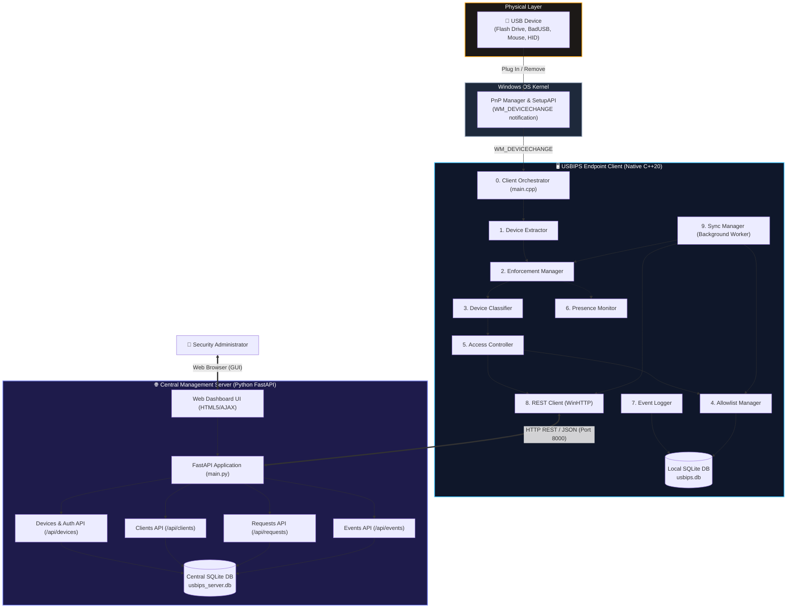
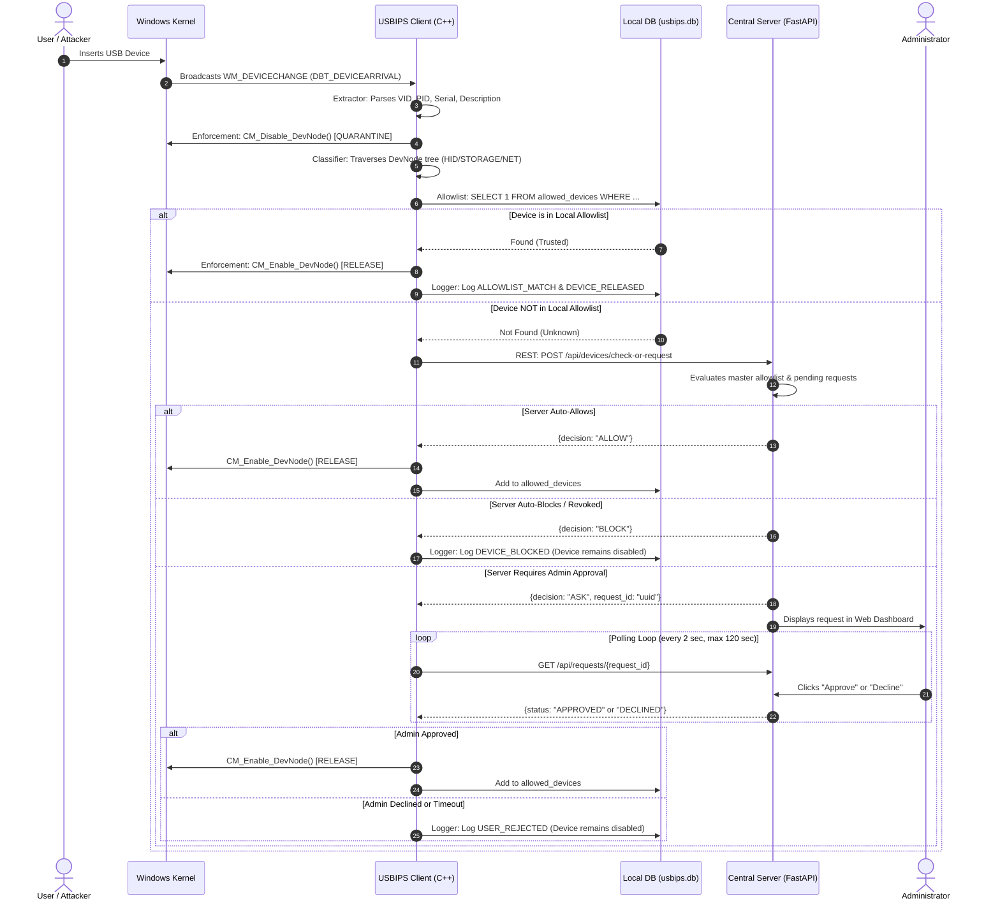
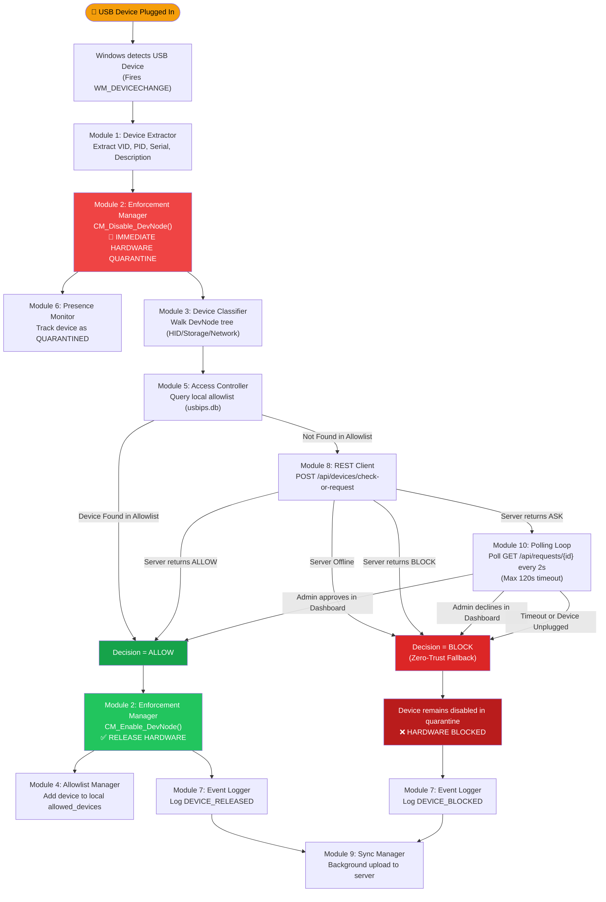

# USBIPS — Architecture, Modules & Algorithms Guide

> **USB Intrusion Prevention System (USBIPS)**  
> A Zero-Trust Hardware Access-Control & Security Telemetry System for Windows Endpoints.  
> *Designed for efficient learning, clear understanding, and technical review.*

---

## Table of Contents
1. [High-Level System Architecture](#1-high-level-system-architecture)
2. [End-to-End Data Flow](#2-end-to-end-data-flow)
3. [Client Modules, Sub-Modules & Algorithms](#3-client-modules-sub-modules--algorithms)
   - [Module 1: Device Extractor](#module-1-device-extractor)
   - [Module 2: Enforcement Manager (Quarantine & Release)](#module-2-enforcement-manager)
   - [Module 3: Device Classifier](#module-3-device-classifier)
   - [Module 4: Allowlist Manager](#module-4-allowlist-manager)
   - [Module 5: Access Controller](#module-5-access-controller)
   - [Module 6: Device Presence Monitor](#module-6-device-presence-monitor)
   - [Module 7: Event Logger](#module-7-event-logger)
   - [Module 8: REST Client](#module-8-rest-client)
   - [Module 9: Sync Manager](#module-9-sync-manager)
   - [Module 10: Client Orchestrator (main.cpp)](#module-10-client-orchestrator-maincpp)
4. [Server Modules, Sub-Modules & Algorithms](#4-server-modules-sub-modules--algorithms)
   - [Module 11: Database & Lifespan Controller](#module-11-database--lifespan-controller)
   - [Module 12: Devices & Authorization API](#module-12-devices--authorization-api)
   - [Module 13: Clients Management API](#module-13-clients-management-api)
   - [Module 14: Requests Review API](#module-14-requests-review-api)
   - [Module 15: Security Telemetry & Events API](#module-15-security-telemetry--events-api)
   - [Module 16: Web Dashboard Administration UI](#module-16-web-dashboard-administration-ui)
5. [Master Implementation Flowchart (Plug-to-Decision)](#5-master-implementation-flowchart)
6. [Quick Revision Summary](#6-quick-revision-summary)

---

## 1. High-Level System Architecture

The USBIPS system follows a **distributed client-server architecture** implementing the **Zero-Trust Security Principle** (*"Never trust, always verify, quarantine immediately"*):



### Architectural Core Concepts:
1. **Endpoint Protection (Zero-Trust Quarantine)**: The moment an unknown USB peripheral is attached, Windows assigns it a device node. USBIPS catches this notification and **immediately disables the hardware node** before Windows can mount storage filesystems or install unauthorized HID drivers.
2. **Local Autonomy**: The client maintains a local cache database (`usbips.db`). Even if the network cable is unplugged or the server is down, pre-approved company devices continue to work seamlessly.
3. **Centralized Governance**: All unknown devices trigger an escalation to the server. The administrator can approve, reject, or revoke authorizations remotely via the Web Dashboard.

---

## 2. End-to-End Data Flow

The following sequence details how data traverses between physical hardware, operating system, client modules, and the central server.



---

## 3. Client Modules, Sub-Modules & Algorithms

The client endpoint consists of 10 primary modules. Each module is documented below with its **sub-modules**, **underlying algorithms**, and **step-by-step working**.

---

### Module 1: Device Extractor
* **Source Files**: `Extractor/DeviceInfoExtractor.h`, `Extractor/DeviceInfoExtractor.cpp`
* **Purpose**: Intercepts the raw Windows device interface path and extracts complete hardware identity information.

#### Sub-Modules:
1. **VID/PID Regex Parser**: Parses vendor and product hex identifiers from device paths.
2. **Serial / Instance Component Tokenizer**: Splits hash-delimited interface paths to isolate hardware serial numbers.
3. **SetupAPI Device Enumerator**: Queries the Windows SetupAPI device database for active USB device interfaces.
4. **Hardware Property Reader**: Queries device registry properties such as Friendly Name, Description, and Hardware IDs.

#### Algorithm 1.1: Hardware Identity Extraction Algorithm
* **Goal**: Convert a raw system path (e.g., `\\?\USB#VID_0781&PID_5583#4C53000...#{a5dcbf10...}`) into a structured `USBDevice` object.
* **Working**:
```
Algorithm: ExtractDeviceInfo(devicePath)
Input:     devicePath (Wide String)
Output:    USBDevice (Populated struct with VID, PID, Serial, Description)

1. EXECUTE Regex Search on devicePath using pattern "VID_([0-9A-Fa-f]{4})&PID_([0-9A-Fa-f]{4})":
   - IF matched:
       SET device.vendorId = match[1]
       SET device.productId = match[2]
   - ELSE:
       SET vendorId and productId to EMPTY

2. TOKENIZE devicePath by '#' delimiter:
   - Extract the 3rd token (between 2nd and 3rd '#' characters).
   - SET device.serialNumber = token.

3. INITIALIZE Windows SetupAPI interface set:
   - Call SetupDiGetClassDevsW(&GUID_DEVINTERFACE_USB_DEVICE, DIGCF_PRESENT | DIGCF_DEVICEINTERFACE).
   
4. ITERATE through all device interfaces (index = 0, 1, 2...):
   - Call SetupDiEnumDeviceInterfaces().
   - Query interface path via SetupDiGetDeviceInterfaceDetailW().
   - IF interface path matches devicePath (case-insensitive):
       a. Call SetupDiGetDeviceRegistryPropertyW(SPDRP_DEVICEDESC) -> device.description
       b. Call SetupDiGetDeviceRegistryPropertyW(SPDRP_MFG)        -> device.manufacturer
       c. Call SetupDiGetDeviceRegistryPropertyW(SPDRP_HARDWAREID) -> device.hardwareIds
       d. Call SetupDiGetDeviceInstanceIdW()                      -> device.deviceId
       e. BREAK iteration and return SUCCESS.

5. CLEANUP SetupAPI device set handle via SetupDiDestroyDeviceInfoList().
```

---

### Module 2: Enforcement Manager
* **Source Files**: `Enforcement/EnforcementManager.h`, `Enforcement/EnforcementManager.cpp`
* **Purpose**: Directly communicates with the Windows kernel Plug and Play (PnP) Configuration Manager to enable or disable physical hardware at the bus level.

#### Sub-Modules:
1. **Device Node Locator**: Converts a device instance ID into a kernel `DEVINST` handle using `CM_Locate_DevNodeW`.
2. **Quarantine Controller**: Disables device operation using `CM_Disable_DevNode`.
3. **Release Controller**: Enables and restores device operation using `CM_Enable_DevNode`.
4. **Veto Recovery Engine**: Retries disable requests with backoff if Windows kernel vetoes the transition.

#### Algorithm 2.1: Resilient Hardware Quarantine with Backoff
* **Goal**: Physically disable an unauthorized USB device immediately, preventing PnP drivers from loading.
* **Working**:
```
Algorithm: QuarantineDevice(device)
Input:     device (USBDevice struct containing deviceId)
Output:    Boolean (TRUE if successfully quarantined, FALSE otherwise)

1. IF device.deviceId is EMPTY:
   - Log error and RETURN FALSE.

2. SET maxAttempts = 5.
3. FOR attempt = 1 TO maxAttempts DO:
   a. Call CM_Locate_DevNodeW(&devInst, device.deviceId, CM_LOCATE_DEVNODE_NORMAL).
      - IF result != CR_SUCCESS:
          Log error and RETURN FALSE.
          
   b. Call CM_Disable_DevNode(devInst, CM_DISABLE_UI_NOT_OK).
   
   c. IF result == CR_SUCCESS:
          Log "[ENFORCEMENT] Device successfully quarantined."
          RETURN TRUE.
          
   d. IF result == CR_REMOVE_VETOED:
          // Windows OS is currently busy initializing or writing to the device.
          Log "[ENFORCEMENT] Disable vetoed by OS. Retrying in 300ms..."
          SLEEP 300 milliseconds.
          CONTINUE loop.
          
   e. ELSE (any other fatal error):
          Log fatal error with CONFIGRET code.
          RETURN FALSE.

4. Log "[SECURITY] Could not disable after 5 attempts. Fail safe."
5. RETURN FALSE.
```

#### Algorithm 2.2: Hardware Release Algorithm
* **Goal**: Re-activate a quarantined device once administrator or allowlist approval is granted.
* **Working**:
```
Algorithm: ReleaseDevice(device)
Input:     device (USBDevice struct)
Output:    Boolean (TRUE if enabled, FALSE otherwise)

1. Call CM_Locate_DevNodeW(&devInst, device.deviceId).
   - IF failed: RETURN FALSE.

2. Call CM_Enable_DevNode(devInst, 0).
   - IF result == CR_SUCCESS:
       Log "[ENFORCEMENT] Device successfully enabled."
       RETURN TRUE.
   - ELSE:
       Log error code and RETURN FALSE.
```

---

### Module 3: Device Classifier
* **Source Files**: `Classifier/DeviceClassifier.h`, `Classifier/DeviceClassifier.cpp`
* **Purpose**: Identifies the device category (Human Interface Device, Mass Storage, Network Adapter, or Other/Composite) by walking the entire hardware devnode sub-tree.

#### Sub-Modules:
1. **DevNode Property Inspector**: Retrieves Registry properties (Class, Service, Device ID) from any arbitrary devnode.
2. **Device Tree Walker**: Recursively descends from the root USB hub node to all leaf child and sibling nodes.
3. **Category Rules Engine**: Matches devnode properties against signature patterns for HID, Storage, and Network devices.
4. **Primary Type Resolver**: Resolves ambiguity if a device presents single or multiple composite capabilities.

#### Algorithm 3.1: Recursive DevNode Tree Traversal (DFS with Depth Guard)
* **Goal**: Discover all physical functions of a USB device, including composite devices (e.g., a flash drive with a hidden keyboard payload).
* **Working**:
```
Algorithm: AnalyzeChildren(parentDevInst, device, depth)
Input:     parentDevInst (DEVINST), device (USBDevice Reference), depth (Integer)

1. IF depth > 20 THEN RETURN. // Prevent infinite recursion

2. Call CM_Get_Child(&childDevInst, parentDevInst, 0).
   - IF result != CR_SUCCESS THEN RETURN.

3. WHILE TRUE DO:
   a. AnalyzeDevNode(childDevInst, device):
      - Query CM_DRP_CLASS, CM_DRP_SERVICE, and Device ID from childDevInst.
      - IF Class == "HIDCLASS" OR DeviceID starts with "HID\" OR Service == "HIDUSB":
          SET device.hasHID = TRUE.
      - IF Class IN {"USBSTOR", "DISKDRIVE", "VOLUME"} OR Service == "USBSTOR":
          SET device.hasStorage = TRUE.
      - IF Class == "NET" OR Service == "NDIS":
          SET device.hasNetwork = TRUE.
          
   b. RECURSE: AnalyzeChildren(childDevInst, device, depth + 1).
   
   c. Call CM_Get_Sibling(&siblingDevInst, childDevInst, 0).
      - IF result != CR_SUCCESS THEN BREAK loop.
      - SET childDevInst = siblingDevInst.
```

#### Algorithm 3.2: Multi-Factor Device Type Resolution
* **Goal**: Assign the final classification enum (`HID`, `STORAGE`, `NETWORK`, or `OTHER`).
* **Working**:
```
Algorithm: ResolvePrimaryType(device)
1. SET count = 0.
2. IF device.hasHID == TRUE THEN count = count + 1.
3. IF device.hasStorage == TRUE THEN count = count + 1.
4. IF device.hasNetwork == TRUE THEN count = count + 1.

5. IF count == 1 THEN:
     - IF device.hasHID     -> device.type = DeviceType::HID
     - IF device.hasStorage -> device.type = DeviceType::STORAGE
     - IF device.hasNetwork -> device.type = DeviceType::NETWORK
   ELSE:
     // If 0 capabilities or multiple (e.g. Rubber Ducky mimicking keyboard + flash drive)
     device.type = DeviceType::OTHER.
```

---

### Module 4: Allowlist Manager
* **Source Files**: `Allowlist/AllowlistManager.h`, `Allowlist/AllowlistManager.cpp`
* **Purpose**: Manages the local SQLite database of approved devices (`allowed_devices` table) for zero-latency local decisions.

#### Sub-Modules:
1. **Database Initializer**: Opens SQLite connection and creates schema with indexed lookup fields.
2. **Fast-Path Lookup Engine**: Executes parameterized queries checking `(vendor_id, product_id, serial_number)`.
3. **Local Store CRUD**: Adds and removes devices locally.
4. **Differential Sync Engine**: Compares server snapshot against local database, adding new approvals and deleting revoked entries.

#### Algorithm 4.1: Fast-Path Device Authorization Check
* **Goal**: Determine if a device is trusted locally in $O(1)$ time without network calls.
* **Working**:
```
Algorithm: IsAllowed(device)
Input:     device (USBDevice)
Output:    Boolean (TRUE = Allowed, FALSE = Denied)

1. ACQUIRE Mutex lock (thread-safety).
2. PREPARE SQL statement:
   "SELECT 1 FROM allowed_devices 
    WHERE vendor_id = ? AND product_id = ? AND serial_number = ? LIMIT 1;"
3. BIND:
   - Param 1 = device.vendorId
   - Param 2 = device.productId
   - Param 3 = device.serialNumber
4. EXECUTE sqlite3_step():
   - IF result == SQLITE_ROW:
       FINALIZE statement, RELEASE lock, RETURN TRUE.
   - ELSE:
       FINALIZE statement, RELEASE lock, RETURN FALSE.
```

#### Algorithm 4.2: Two-Way Differential Set Reconciliation
* **Goal**: Reconcile local database with the server's master allowlist in an atomic transaction.
* **Working**:
```
Algorithm: SyncWithRemote(remoteDevices)
Input:     remoteDevices (Array of AllowedDevice from server)
Output:    Boolean (SUCCESS/FAILURE)

1. ACQUIRE Mutex lock.
2. BUILD in-memory hash set of server keys:
   remoteSet = { (d.vendorId, d.productId, d.serialNumber) for d in remoteDevices }

3. BEGIN SQLite TRANSACTION:
4. QUERY all local devices from allowed_devices table.
5. FOR EACH localDevice in localDevices DO:
   - key = (localDevice.vendorId, localDevice.productId, localDevice.serialNumber)
   - IF key NOT IN remoteSet THEN:
       // Device was revoked on the central server!
       EXECUTE "DELETE FROM allowed_devices WHERE id = localDevice.id;"

6. FOR EACH remoteDevice in remoteDevices DO:
   - key = (remoteDevice.vendorId, remoteDevice.productId, remoteDevice.serialNumber)
   - IF key NOT IN localSet THEN:
       // New approval from central administrator!
       EXECUTE "INSERT INTO allowed_devices (vendor_id, product_id, serial_number, device_type, description, manufacturer) VALUES (?, ?, ?, ?, ?, ?);"

7. COMMIT SQLite TRANSACTION.
8. RELEASE lock and RETURN TRUE.
```

---

### Module 5: Access Controller
* **Source Files**: `AccessControl/AccessController.h`, `AccessControl/AccessController.cpp`
* **Purpose**: Policy Decision Point (PDP) that decides whether a device is allowed or must be escalated to the central server.

#### Sub-Modules:
1. **Local Policy Evaluator**: Queries `AllowlistManager::IsAllowed`.
2. **Decision Mapper**: Translates evaluation results to `AccessDecision` enum values (`ALLOW`, `ASK`, `BLOCK`).

#### Algorithm 5.1: Zero-Trust Local Policy Evaluation
```
Algorithm: EvaluateAccess(device, allowlist)
Input:     device (USBDevice), allowlist (AllowlistManager instance)
Output:    AccessDecision (ALLOW or ASK)

1. IF allowlist.IsAllowed(device) == TRUE THEN:
       RETURN AccessDecision::ALLOW.
2. ELSE:
       // Zero-Trust: Unknown devices are never blindly trusted
       RETURN AccessDecision::ASK.
```

---

### Module 6: Device Presence Monitor
* **Source Files**: `Presence/DevicePresenceMonitor.h`, `Presence/DevicePresenceMonitor.cpp`
* **Purpose**: Monitors the physical presence of devices while they are quarantined or awaiting administrator decision.

#### Sub-Modules:
1. **Device Registry**: Thread-safe vector tracking active quarantined or released devices.
2. **Liveness Poller**: Background thread calling `CM_Locate_DevNodeW` every 500ms.
3. **Disconnection Filter**: Requires 2 consecutive missing checks to prevent false disconnection alarms.
4. **Audit Dispatcher**: Logs `DEVICE_REMOVED` events when physical removal is confirmed.

#### Algorithm 6.1: Physical Presence & Disconnect Detection
```
Algorithm: MonitorLoop()
1. WHILE g_running == TRUE DO:
   a. ACQUIRE Mutex lock.
   b. FOR EACH device IN g_trackedDevices DO:
      - Calculate elapsed time since tracking began.
      - IF elapsed < 2 seconds THEN CONTINUE. // Initial stabilization grace period
      
      - Call CM_Locate_DevNodeW(&devInst, device.deviceId, CM_LOCATE_DEVNODE_NORMAL).
      - IF result == CR_SUCCESS THEN:
          SET device.missingChecks = 0. // Device is physically present
      - ELSE:
          device.missingChecks = device.missingChecks + 1.
          
      - IF device.missingChecks >= 2 THEN:
          // Device physically unplugged!
          LogEvent(DEVICE_REMOVED, device, "Physical disconnect detected").
          REMOVE device FROM g_trackedDevices.
          
   c. RELEASE Mutex lock.
   d. SLEEP 500 milliseconds.
```

---

### Module 7: Event Logger
* **Source Files**: `Logging/EventLogger.h`, `Logging/EventLogger.cpp`
* **Purpose**: Records all security-sensitive events in local SQLite storage and prepares them for batch telemetry upload.

#### Sub-Modules:
1. **Machine GUID Resolver**: Extracts the unique Windows Machine GUID from `SOFTWARE\Microsoft\Cryptography`.
2. **UUID Generator**: Produces RFC 4122 compliant UUIDs via Windows `CoCreateGuid()`.
3. **Audit Log Store**: Writes event records with timestamp, device info, decision, and `sync_status = 'PENDING'`.
4. **Telemetry Batch Extractor**: Queries pending events and marks them `SYNCED` post-upload.

#### Algorithm 7.1: Cryptographic Event Generation & Logging
```
Algorithm: LogEvent(eventType, device, decision, reason)
1. Generate unique event_id using CoCreateGuid().
2. Retrieve cached client_id (Machine GUID).
3. Obtain current ISO-8601 UTC timestamp (e.g. "2026-09-07T00:45:00Z").
4. PREPARE SQL:
   "INSERT INTO security_events (event_id, client_id, timestamp, event_type, 
    vendor_id, product_id, serial_number, device_id, device_type, description, 
    decision, reason, sync_status) VALUES (?, ?, ?, ?, ?, ?, ?, ?, ?, ?, ?, ?, 'PENDING');"
5. BIND fields and EXECUTE statement.
```

---

### Module 8: REST Client
* **Source Files**: `Network/RestClient.h`, `Network/RestClient.cpp`
* **Purpose**: Provides native HTTP/HTTPS client communication with the FastAPI server using the Windows `WinHTTP` library without any external DLLs.

#### Sub-Modules:
1. **WinHTTP Connection Manager**: Initializes session, connection, and request handles (`WinHttpOpen`, `WinHttpConnect`, `WinHttpOpenRequest`).
2. **Unicode/UTF-8 Transcoder**: Converts wide Windows strings (`wchar_t`) to UTF-8 JSON payloads and vice-versa.
3. **API Endpoint Wrappers**: Implements registration, heartbeat, allowlist download, event upload, and device check calls.
4. **Response Deserializer**: Parses JSON strings from server responses into structured C++ types.

#### Algorithm 8.1: Native WinHTTP Synchronous Request-Response
```
Algorithm: SendHttpRequest(verb, path, jsonBody, outResponse)
1. Call WinHttpOpen() -> hSession.
2. Call WinHttpConnect(hSession, serverHost, serverPort) -> hConnect.
3. Call WinHttpOpenRequest(hConnect, verb, path) -> hRequest.
4. Add Header: "Content-Type: application/json\r\n".
5. Call WinHttpSendRequest(hRequest, ..., jsonBody.data(), jsonBody.size()).
6. Call WinHttpReceiveResponse(hRequest).
7. Query Status Code via WinHttpQueryHeaders(WINHTTP_QUERY_STATUS_CODE).
8. Read response body in loop via WinHttpReadData().
9. CLOSE all handles (hRequest, hConnect, hSession).
10. RETURN outResponse and statusCode.
```

---

### Module 9: Sync Manager
* **Source Files**: `Network/SyncManager.h`, `Network/SyncManager.cpp`
* **Purpose**: Coordinates background synchronization between client and server every 5 seconds.

#### Sub-Modules:
1. **Worker Loop Thread**: Dedicated thread waking up periodically or via trigger.
2. **System Telemetry Collector**: Gathers Hostname (`GetComputerNameW`), IP Address (`Winsock getaddrinfo`), and OS Version.
3. **Heartbeat Emitter**: Emits regular client health heartbeats.
4. **Real-Time Revocation Enforcer**: Verifies all currently active hardware against the freshly updated allowlist.

#### Algorithm 9.1: Background Sync Cycle & Real-Time Revocation
```
Algorithm: PerformSyncCycle()
1. Check server health via GET /health.
   - IF offline: Log warning and EXIT cycle.

2. IF client not yet registered THEN:
   - Call POST /api/clients/register with Hostname, IP, OS Version.

3. Call POST /api/clients/heartbeat with status="ONLINE".

4. Fetch Remote Allowlist via GET /api/devices.
5. Merge into local DB via AllowlistManager::SyncWithRemote(remoteDevices).

6. // REAL-TIME REVOCATION ENFORCEMENT:
   activeDevices = PresenceMonitor::GetTrackedDevices().
   FOR EACH device IN activeDevices DO:
       IF device.state == RELEASED THEN:
           IF AllowlistManager::IsAllowed(device) == FALSE THEN:
               // Device was revoked by Administrator while plugged in!
               EnforcementManager::QuarantineDevice(device).
               PresenceMonitor::SetDeviceState(device.deviceId, QUARANTINED).
               EventLogger::LogEvent(DEVICE_BLOCKED, device, "BLOCK", "Real-time revocation").

7. Upload Pending Events:
   pendingEvents = EventLogger::GetPendingSyncEvents(100).
   IF pendingEvents NOT EMPTY THEN:
       Call POST /api/events/batch.
       IF upload successful:
           EventLogger::MarkEventsSynced(eventIds).
```

---

### Module 10: Client Orchestrator (main.cpp)
* **Source Files**: `main.cpp`
* **Purpose**: Window creation, Windows message pump, and event dispatcher coordinating all client components.

#### Sub-Modules:
1. **Hidden Message Window**: Registers window class and creates a message-only window (`HWND_MESSAGE`).
2. **Device Notification Registrar**: Calls `RegisterDeviceNotificationW` for `GUID_DEVINTERFACE_USB_DEVICE`.
3. **Window Procedure (WndProc)**: Intercepts `WM_DEVICECHANGE` (`DBT_DEVICEARRIVAL` and `DBT_DEVICEREMOVECOMPLETE`).
4. **Approval Polling Loop**: Polls the server when a device is in `ASK` state, observing timeout and physical disconnect.

#### Algorithm 10.1: Windows Message Dispatch & Device Evaluation Loop
```
Algorithm: WndProc(hwnd, msg, wParam, lParam)
1. IF msg == WM_DEVICECHANGE THEN:
   a. IF wParam == DBT_DEVICEARRIVAL THEN:
      - Read DEV_BROADCAST_DEVICEINTERFACE structure from lParam.
      - Extract device info using DeviceInfoExtractor::Extract().
      - Immediately call EnforcementManager::QuarantineDevice() [Zero-Trust].
      - Add to PresenceMonitor::TrackDevice().
      - Call DeviceClassifier::Classify().
      - Evaluate local policy using AccessController::Evaluate().
      - IF ALLOW -> Release device and log.
      - IF ASK   -> Escalate to server (POST check-or-request).
                   Enter polling loop (2s interval, 120s timeout).
                   IF Approved -> Release device.
                   ELSE -> Keep quarantined.

   b. IF wParam == DBT_DEVICEREMOVECOMPLETE THEN:
      - Identify removed interface path.
      - Log physical disconnection event.
      - Remove from PresenceMonitor.

2. RETURN DefWindowProc(hwnd, msg, wParam, lParam).
```

---

## 4. Server Modules, Sub-Modules & Algorithms

The Central Management Server is built on Python 3.10+ and FastAPI. It maintains `usbips_server.db` and provides an administrative interface.

---

### Module 11: Database & Lifespan Controller
* **Source Files**: `server/app/main.py`, `server/app/database/db.py`
* **Purpose**: Manages SQLite connections, thread safety, and auto-initialization of server tables.

#### Sub-Modules:
1. **Connection Factory**: Context manager providing SQLite connections with `row_factory = sqlite3.Row`.
2. **Schema Initializer**: Creates the 4 core tables (`clients`, `master_allowlist`, `pending_requests`, `server_events`) with indexes.
3. **FastAPI Lifespan Context**: Ensures database tables exist before server begins processing HTTP requests.

---

### Module 12: Devices & Authorization API
* **Source Files**: `server/app/api/devices.py`
* **Purpose**: Core authorization decision engine that answers client checks and handles administrator allowlist modifications.

#### Sub-Modules:
1. **Authorization Engine**: Implements the hierarchical decision pipeline.
2. **Master Allowlist CRUD**: Adds, updates, and deletes allowed hardware records.
3. **Cascade Revocation Controller**: Coordinates the simultaneous purge of a device from the allowlist and marking of pending requests as `REVOKED`.

#### Algorithm 12.1: Hierarchical Authorization Decision Algorithm
* **Endpoint**: `POST /api/devices/check-or-request`
* **Working**:
```
Algorithm: check_or_request_device(vendor_id, product_id, serial_number)
Input:     VID, PID, Serial, DeviceType, ClientId
Output:    DeviceCheckResponse (decision: "ALLOW" | "ASK" | "BLOCK")

1. Normalize VID and PID to Uppercase.
2. STEP 1: Query master_allowlist table:
   "SELECT id FROM master_allowlist 
    WHERE vendor_id = ? AND product_id = ? AND serial_number = ? AND status = 'APPROVED';"
   - IF FOUND:
       RETURN { decision: "ALLOW", request_status: "APPROVED" }.

3. STEP 2: Query pending_requests table for existing entries:
   "SELECT request_id, status FROM pending_requests 
    WHERE vendor_id = ? AND product_id = ? AND serial_number = ? 
    ORDER BY requested_at DESC LIMIT 1;"
   - IF FOUND:
       - IF status == "APPROVED":
           // Was approved earlier, but missing from master_allowlist -> IT WAS REVOKED!
           UPDATE pending_requests SET status = 'REVOKED' WHERE request_id = req.id.
           RETURN { decision: "BLOCK", request_status: "REVOKED" }.
       - IF status IN ("DECLINED", "REVOKED"):
           RETURN { decision: "BLOCK", request_status: status }.
       - IF status == "PENDING":
           RETURN { decision: "ASK", request_id: req.id, request_status: "PENDING" }.

4. STEP 3: No records exist. Create a new pending request:
   - Generate new request_id (UUID v4).
   - INSERT INTO pending_requests (status = 'PENDING', requested_at = NOW()).
   - RETURN { decision: "ASK", request_id: new_id, request_status: "PENDING" }.
```

#### Algorithm 12.2: Cascade Revocation Algorithm
* **Endpoint**: `DELETE /api/devices/{device_id}`
* **Working**:
```
Algorithm: RevokeDevice(device_id)
1. Query device details (VID, PID, Serial) from master_allowlist by device_id.
   - IF not found: RETURN 404 Not Found.

2. DELETE record FROM master_allowlist WHERE id = device_id.

3. UPDATE pending_requests 
   SET status = 'REVOKED', decided_at = NOW(), decision_by = 'Administrator'
   WHERE vendor_id = dev.VID AND product_id = dev.PID AND serial_number = dev.Serial.
   
4. IF no rows were updated:
   - INSERT INTO pending_requests with status = 'REVOKED' so all clients enforce blocking.

5. INSERT security event into server_events:
   - event_type = "DEVICE_BLOCKED"
   - decision = "BLOCK"
   - reason = "Authorization revoked by administrator".

6. RETURN { status: "success", message: "Device revoked" }.
```

---

### Module 13: Clients Management API
* **Source Files**: `server/app/api/clients.py`
* **Purpose**: Tracks registered endpoint machines and determines online/offline status.

#### Sub-Modules:
1. **Client Registrar**: Upserts client information into the `clients` table on registration.
2. **Heartbeat Receiver**: Updates `last_seen` timestamp and client status.
3. **Liveness Evaluator**: Evaluates whether a client is active based on a 45-second heartbeat threshold.

#### Algorithm 13.1: Heartbeat Status Evaluation
```
Algorithm: GetClientOnlineStatus(client)
1. Calculate delta = CurrentTime - client.last_seen.
2. IF delta > 45 seconds THEN:
       client.status = "OFFLINE".
   ELSE:
       client.status = "ONLINE".
3. RETURN client.
```

---

### Module 14: Requests Review API
* **Source Files**: `server/app/api/requests.py`
* **Purpose**: Manages pending access requests generated by unknown USB devices plugged into endpoints.

#### Sub-Modules:
1. **Pending Request Lister**: Supplies the Web Dashboard with open requests.
2. **Approve Action Handler**: Moves a request to `APPROVED` and inserts the device into `master_allowlist`.
3. **Decline Action Handler**: Moves a request to `DECLINED` and marks decision timestamp.

#### Algorithm 14.1: Request Approval Workflow
```
Algorithm: ApproveRequest(request_id)
1. SELECT request FROM pending_requests WHERE request_id = request_id.
2. UPDATE pending_requests SET status = 'APPROVED', decided_at = NOW() WHERE request_id = request_id.
3. UPSERT INTO master_allowlist (vendor_id, product_id, serial_number, device_type, description, status):
   - IF exists, SET status = 'APPROVED'.
4. INSERT audit event into server_events (event_type = 'USER_APPROVED').
5. RETURN { status: "success" }.
```

---

### Module 15: Security Telemetry & Events API
* **Source Files**: `server/app/api/events.py`
* **Purpose**: Collects, validates, and stores audit logs transmitted by endpoint clients.

#### Sub-Modules:
1. **Batch Ingestion Engine**: Validates lists of `SecurityEventCreate` schemas and inserts them with `INSERT OR IGNORE`.
2. **Telemetry Filter**: Provides paginated and filtered queries for the admin dashboard.

---

### Module 16: Web Dashboard Administration UI
* **Source Files**: `server/app/templates/index.html`
* **Purpose**: Single-page administrative user interface for real-time monitoring and control.

#### Sub-Modules:
1. **Status Cards & Metrics Panel**: Displays total clients, online count, allowed devices, and pending reviews.
2. **Pending Requests Manager**: Allows one-click Approve / Decline of unknown USB devices.
3. **Allowlist Manager**: Allows manual addition, editing, or revocation of devices.
4. **Live Audit Stream**: Auto-refreshes security telemetry every 3 seconds via asynchronous JavaScript fetches.

---

## 5. Master Implementation Flowchart

The following flowchart demonstrates the complete operational lifecycle from physical insertion to enforcement:



---

## 6. Quick Revision Summary

Use this table for quick revision during reviews, viva examinations, or implementation checks:

| # | Module Name | Language / Tech | Primary Algorithm / Method | Key Input / Output |
|---|---|---|---|---|
| **1** | **Device Extractor** | C++ (SetupAPI, Regex) | Regex extraction + SetupAPI enumeration | Device Path $\rightarrow$ `USBDevice` (VID, PID, Serial) |
| **2** | **Enforcement Manager** | C++ (Configuration Manager) | `CM_Disable_DevNode` with retry/backoff on veto | `DEVINST` handle $\rightarrow$ Hardware Enabled / Disabled |
| **3** | **Device Classifier** | C++ (cfgmgr32) | Depth-first search (DFS) tree traversal | Root `DEVINST` $\rightarrow$ Class (`HID`, `STORAGE`, `NET`) |
| **4** | **Allowlist Manager** | C++ (SQLite3) | Fast $O(1)$ index lookup + 2-way differential set merge | Hardware Tuple $\rightarrow$ Boolean (`true`/`false`) |
| **5** | **Access Controller** | C++ | Zero-trust local evaluation | `USBDevice` $\rightarrow$ `AccessDecision` (`ALLOW` / `ASK`) |
| **6** | **Presence Monitor** | C++ (Threads, cfgmgr32) | 500ms polling + 2-consecutive-miss disconnect filter | `deviceId` $\rightarrow$ Physical status & Disconnect events |
| **7** | **Event Logger** | C++ (SQLite3, CoCreateGuid) | Cryptographic UUID generation + atomic insert | Security event $\rightarrow$ Indexed database record |
| **8** | **REST Client** | C++ (WinHTTP) | Synchronous WinHTTP session request/response | JSON payload $\rightarrow$ Server decision / allowlist |
| **9** | **Sync Manager** | C++ (std::thread) | 5s periodic sync loop + active revocation check | Server allowlist $\rightarrow$ Local reconciliation & enforcement |
| **10** | **Client Orchestrator** | C++ (Win32 API) | Message pump listening for `WM_DEVICECHANGE` | OS PnP broadcast $\rightarrow$ Pipeline trigger |
| **11** | **Database & Lifespan** | Python (FastAPI, sqlite3) | Lazy init + context-managed thread connections | SQL statements $\rightarrow$ Persisted state |
| **12** | **Devices API** | Python (FastAPI) | Hierarchical decision evaluation + cascade delete | Check request $\rightarrow$ `ALLOW` / `ASK` / `BLOCK` |
| **13** | **Clients API** | Python (FastAPI) | Timestamp delta comparison (45s threshold) | Client heartbeat $\rightarrow$ Online/Offline status |
| **14** | **Requests API** | Python (FastAPI) | Approval state transition + allowlist upsert | Admin action $\rightarrow$ Request status updated |
| **15** | **Events API** | Python (FastAPI) | Batch ingest with conflict avoidance (`INSERT OR IGNORE`) | Client event array $\rightarrow$ Ingestion count |
| **16** | **Web Dashboard** | HTML5, CSS3, JavaScript | AJAX polling stream (3s interval) | REST endpoints $\rightarrow$ Dynamic interactive UI |
