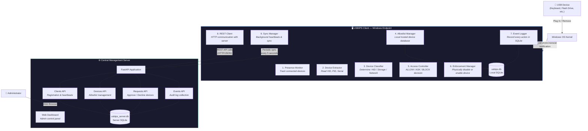
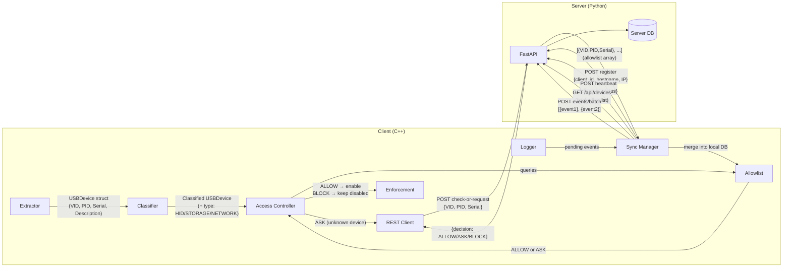
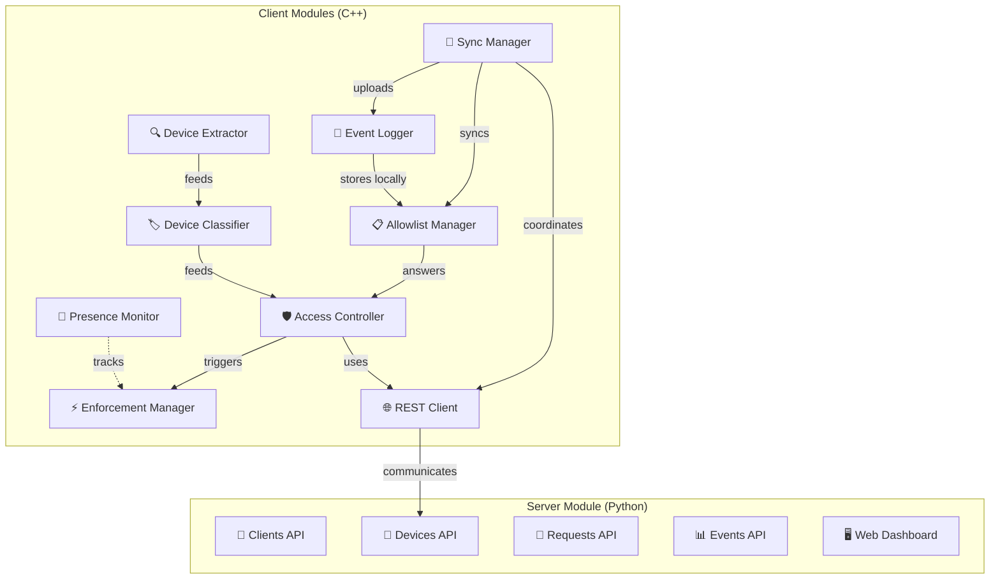
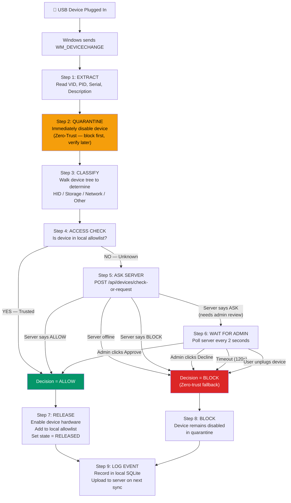
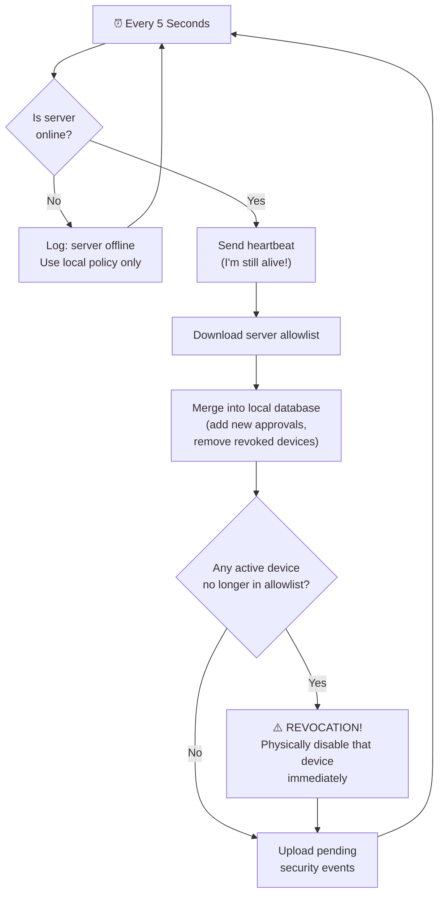

# USBIPS — System Design & Architecture

> **USB Intrusion Prevention System** — A zero-trust USB access control system that detects, identifies, classifies, and enforces security policy on every USB device connected to a Windows endpoint, managed centrally through a web-based server.

---

## 1. System Architecture

The system has **two main parts** that communicate over a REST API:

| Part | Technology | Role |
|---|---|---|
| **USBIPS Client** | C++20 Windows Application | Runs on each endpoint PC. Detects USB devices, enforces security (physically disables/enables hardware) |
| **Central Server** | Python FastAPI Web Server | Central management point. Administrator approves/revokes devices through a web dashboard |

### 1.1 Architecture Diagram



---

### 1.2 Data Flow Between Components

The diagram below shows **what data moves** between each component and in which direction:



### 1.3 Data Flow Summary Table

| # | From → To | Data Transferred | When |
|---|---|---|---|
| 1 | **Windows → Client** | Device interface path (raw string) | USB plug-in / removal event |
| 2 | **Extractor → Classifier** | `USBDevice` struct (VID, PID, Serial, Description, Manufacturer) | Every device connection |
| 3 | **Classifier → Access Controller** | Classified `USBDevice` (+ type: HID/STORAGE/NETWORK/OTHER) | After classification |
| 4 | **Access Controller → Allowlist** | Query: "Is this VID+PID+Serial trusted?" | Every device connection |
| 5 | **Allowlist → Access Controller** | Answer: `ALLOW` (trusted) or `ASK` (unknown) | Every device connection |
| 6 | **Access Controller → Enforcement** | Command: disable device or enable device | After decision is made |
| 7 | **Client → Server** | `{client_id, hostname, ip_address, os_version}` | On startup (registration) |
| 8 | **Client → Server** | `{client_id, status: "ONLINE"}` | Every 5 seconds (heartbeat) |
| 9 | **Client → Server** | `{VID, PID, Serial, device_type}` | Unknown device check request |
| 10 | **Server → Client** | `{decision: "ALLOW"/"ASK"/"BLOCK"}` | Response to device check |
| 11 | **Server → Client** | `[{VID,PID,Serial}, ...]` (full allowlist) | Every 5 seconds (sync) |
| 12 | **Client → Server** | `[{event1}, {event2}, ...]` (security events) | Every 5 seconds (batch upload) |
| 13 | **Admin → Server** | Click "Approve" or "Decline" | Manual action on web dashboard |

---

## 2. Modules of the Proposed System

The USBIPS system is organized into **9 client-side modules** and **1 server module** (with 5 sub-modules). Each module has a single, clear responsibility.

### Module Overview Diagram



---

### 2.1 Module 1: Presence Monitor

> **Purpose**: Keeps track of which USB devices are currently physically connected and their state (quarantined or released).

| Property | Detail |
|---|---|
| **Files** | `Presence/DevicePresenceMonitor.h`, `Presence/DevicePresenceMonitor.cpp` |
| **Pattern** | Background thread polling every 2 seconds |

#### Sub-modules

| Sub-module | What It Does |
|---|---|
| **Device Tracker** | Maintains an in-memory list of all currently connected USB devices with their state (`QUARANTINED` or `RELEASED`) |
| **Monitor Loop** | Background thread that periodically verifies each tracked device is still physically present by querying the Windows device tree |
| **Presence Checker** | Provides a real-time check (`IsDevicePresent`) — used during the admin approval wait to detect if the user unplugs the device |

#### How It Works

```
1. When a USB device is detected and quarantined → TrackDevice() adds it to the list
2. When a device is approved → SetDeviceState(RELEASED) updates its state
3. Every 2 seconds → Monitor Loop checks if each tracked device still exists
4. When Sync Manager detects a revoked device → it reads GetTrackedDevices()
   to find which active devices need to be disabled
```

---

### 2.2 Module 2: Device Extractor

> **Purpose**: Reads the raw device path from Windows and extracts all identity information (VID, PID, Serial Number, Description, Manufacturer).

| Property | Detail |
|---|---|
| **Files** | `Extractor/DeviceInfoExtractor.h`, `Extractor/DeviceInfoExtractor.cpp` |
| **Windows APIs** | SetupAPI (`setupapi.h`) |

#### Sub-modules

| Sub-module | What It Does |
|---|---|
| **VID/PID Parser** | Uses regex `VID_XXXX&PID_XXXX` to extract Vendor ID and Product ID from the device path string |
| **Serial Extractor** | Tokenizes the device path by `#` delimiters to extract the serial number (3rd segment) |
| **Device Locator** | Enumerates all USB device interfaces via Windows SetupAPI and finds the matching device by path |
| **Property Reader** | Reads Windows registry properties: device description, manufacturer name, hardware IDs |

#### Algorithm: Device Information Extraction

```
FUNCTION Extract(devicePath) → USBDevice:
    1. Parse devicePath with regex to get VID and PID
    2. Split devicePath by '#' to get Serial Number
    3. Enumerate all USB interfaces via SetupDiGetClassDevs
    4. For each interface:
        a. Get its detail path via SetupDiGetDeviceInterfaceDetail
        b. If path matches our devicePath (case-insensitive):
            - Read Description  (SPDRP_DEVICEDESC)
            - Read Manufacturer (SPDRP_MFG)
            - Read Hardware IDs (SPDRP_HARDWAREID)
            - Read Instance ID  (SetupDiGetDeviceInstanceId)
            - Return populated USBDevice struct
    5. If no match found → return failure
```

---

### 2.3 Module 3: Device Classifier

> **Purpose**: Determines the functional category of a USB device (HID, Storage, Network, or Other) by analyzing its Windows device tree.

| Property | Detail |
|---|---|
| **Files** | `Classifier/DeviceClassifier.h`, `Classifier/DeviceClassifier.cpp` |
| **Windows APIs** | Configuration Manager (`cfgmgr32.h`) |

#### Sub-modules

| Sub-module | What It Does |
|---|---|
| **Device Tree Walker** | Recursively traverses the Plug-and-Play device tree (parent → children → grandchildren) up to 20 levels deep |
| **HID Detector** | Identifies Human Interface Devices by checking: class = `HIDCLASS`, instance starts with `HID\`, or service = `HIDUSB` |
| **Storage Detector** | Identifies storage devices by checking: class ∈ {`USBSTOR`, `DISKDRIVE`, `VOLUME`}, or service = `USBSTOR` |
| **Network Detector** | Identifies network adapters by checking: class = `NET`, or service = `NDIS` |
| **Type Resolver** | If exactly one capability is detected → assigns that type. If multiple or none → assigns `OTHER` |

#### Algorithm: Device Classification

```
FUNCTION Classify(device) → DeviceType:
    1. Reset all flags: hasHID = false, hasStorage = false, hasNetwork = false
    2. Locate root device node using CM_Locate_DevNode(device.deviceId)
    3. Analyze root node:
        - Read class name, service name, instance ID
        - Check against HID / Storage / Network rules
    4. Recursively analyze all children:
        FOR each child = CM_Get_Child(root):
            - Analyze child node (same as step 3)
            - Recurse into grandchildren via CM_Get_Sibling
    5. Determine primary type:
        - If only hasHID   → type = HID
        - If only hasStorage → type = STORAGE
        - If only hasNetwork → type = NETWORK
        - Otherwise          → type = OTHER
    6. Return classified device
```

---

### 2.4 Module 4: Allowlist Manager

> **Purpose**: Manages the local list of trusted USB devices stored in SQLite. Provides fast lookup for access control decisions and supports synchronization with the central server.

| Property | Detail |
|---|---|
| **Files** | `Allowlist/AllowlistManager.h`, `Allowlist/AllowlistManager.cpp` |
| **Database** | `usbips.db` → `allowed_devices` table |

#### Sub-modules

| Sub-module | What It Does |
|---|---|
| **Database Initializer** | Opens/creates the SQLite database file, creates the `allowed_devices` table if it doesn't exist |
| **Allowlist Lookup** | Queries `SELECT ... WHERE VID=? AND PID=? AND Serial=?` — the critical fast-path check used by Access Controller |
| **Device Adder** | Inserts a newly approved device into the local allowlist (`INSERT OR IGNORE`) |
| **Remote Sync Engine** | Receives the full server allowlist and merges it: adds new approvals, removes revoked devices |

#### Algorithm: Allowlist Synchronization with Server

```
FUNCTION SyncWithRemote(serverDevices[]):
    1. Build a set of (VID, PID, Serial) tuples from serverDevices
    2. BEGIN SQLite Transaction
    3. Get all local devices from allowed_devices table
    4. For each local device:
        IF (VID, PID, Serial) NOT IN server set:
            → DELETE from local table  (device was revoked on server)
    5. For each server device:
        IF (VID, PID, Serial) NOT IN local table:
            → INSERT into local table  (new approval from server)
    6. COMMIT Transaction
```

---

### 2.5 Module 5: Access Controller

> **Purpose**: The policy decision point. Decides whether a USB device should be allowed, blocked, or escalated to the central server for administrator review.

| Property | Detail |
|---|---|
| **Files** | `AccessControl/AccessController.h`, `AccessControl/AccessController.cpp` |

#### Sub-modules

| Sub-module | What It Does |
|---|---|
| **Policy Evaluator** | Queries the local allowlist. If device is found → `ALLOW`. If not found → `ASK` (escalate to server) |
| **Decision Formatter** | Converts the `AccessDecision` enum to human-readable strings |

#### Algorithm: Access Control Decision

```
FUNCTION Evaluate(device, allowlist) → Decision:
    1. Call allowlist.IsAllowed(device)
    2. IF device is in allowlist:
        → Return ALLOW (trusted device)
    3. ELSE:
        → Return ASK (unknown device — needs server authorization)
```

> **Note**: There is no local `BLOCK` decision. Unknown devices are always escalated to the server. If the server is offline, a zero-trust fallback blocks the device.

---

### 2.6 Module 6: Enforcement Manager

> **Purpose**: Physically enables or disables USB hardware at the Windows kernel level. This is how USBIPS actually prevents a malicious device from functioning.

| Property | Detail |
|---|---|
| **Files** | `Enforcement/EnforcementManager.h`, `Enforcement/EnforcementManager.cpp` |
| **Windows APIs** | `CM_Disable_DevNode`, `CM_Enable_DevNode` |
| **Requirement** | Must run with **Administrator privileges** |

#### Sub-modules

| Sub-module | What It Does |
|---|---|
| **Device Node Locator** | Converts a device ID string into a Windows `DEVINST` handle using `CM_Locate_DevNodeW` |
| **Quarantine Engine** | Disables the device using `CM_Disable_DevNode`. Includes retry logic (5 attempts, 300ms delay) for handling Windows state transition conflicts |
| **Release Engine** | Re-enables a quarantined device using `CM_Enable_DevNode`, making it fully operational |

#### Algorithm: Device Quarantine

```
FUNCTION QuarantineDevice(device) → success/failure:
    FOR attempt = 1 to 5:
        1. Locate device node: CM_Locate_DevNode(device.deviceId)
        2. Disable device:     CM_Disable_DevNode(devInst)
        3. IF success → return true
        4. IF result = CR_REMOVE_VETOED:
            (Windows is still processing a previous state change)
            → Wait 300ms and retry
        5. IF other error → return false
    6. All attempts failed → return false
```

---

### 2.7 Module 7: Event Logger

> **Purpose**: Records every security-relevant action as an auditable event in the local SQLite database. Events are later uploaded to the central server.

| Property | Detail |
|---|---|
| **Files** | `Logging/EventLogger.h`, `Logging/EventLogger.cpp` |
| **Database** | `usbips.db` → `security_events` table |
| **Pattern** | Singleton (one global instance) |

#### Sub-modules

| Sub-module | What It Does |
|---|---|
| **Client ID Resolver** | Reads the Windows Machine GUID from the registry — this is the unique identifier for each endpoint PC |
| **Event ID Generator** | Creates a UUID v4 for each event using `CoCreateGuid()` |
| **Event Recorder** | Inserts a `SecurityEvent` record into SQLite with: event_id, client_id, timestamp, event_type, device info, decision, reason |
| **Sync Status Tracker** | Each event has a `sync_status` field (`PENDING` or `SYNCED`). The Sync Manager reads pending events and marks them as synced after successful upload |

#### Event Types Recorded

| Event Type | When It's Logged |
|---|---|
| `DEVICE_CONNECTED` | USB device physically plugged in |
| `DEVICE_QUARANTINED` | Device disabled in zero-trust quarantine |
| `DEVICE_RELEASED` | Device enabled after approval |
| `DEVICE_REMOVED` | USB device physically unplugged |
| `ALLOWLIST_MATCH` | Device found in local trusted list |
| `UNKNOWN_DEVICE` | Device not in allowlist, escalated to server |
| `USER_APPROVED` | Administrator approved the device |
| `USER_REJECTED` | Administrator declined the device |
| `DEVICE_BLOCKED` | Device access denied by policy |

---

### 2.8 Module 8: REST Client

> **Purpose**: Handles all HTTP communication between the C++ client and the Python server. Uses the Windows-native WinHTTP API (no external libraries needed).

| Property | Detail |
|---|---|
| **Files** | `Network/RestClient.h`, `Network/RestClient.cpp` |
| **Protocol** | HTTP/JSON over WinHTTP |
| **Pattern** | Singleton |

#### Sub-modules

| Sub-module | What It Does |
|---|---|
| **HTTP Transport** | Opens WinHTTP session, connects to server, sends request body, reads response. Handles connection failures gracefully |
| **Client Registration** | Sends `POST /api/clients/register` with machine identity (client_id, hostname, IP, OS version) |
| **Heartbeat Sender** | Sends `POST /api/clients/heartbeat` with status (`ONLINE` or `OFFLINE`) |
| **Device Checker** | Sends `POST /api/devices/check-or-request` with device identity. Parses server decision |
| **Request Poller** | Sends `GET /api/requests/{id}` every 2 seconds while waiting for admin decision |
| **Allowlist Fetcher** | Sends `GET /api/devices` to download the full server allowlist |
| **Event Uploader** | Sends `POST /api/events/batch` with a batch of security events |
| **Encoding Converter** | Converts between Windows wide strings (UTF-16) and JSON strings (UTF-8) |

---

### 2.9 Module 9: Sync Manager

> **Purpose**: Runs on a background thread and coordinates all periodic client–server communication: registration, heartbeats, allowlist sync, revocation enforcement, and event upload.

| Property | Detail |
|---|---|
| **Files** | `Network/SyncManager.h`, `Network/SyncManager.cpp` |
| **Pattern** | Singleton, background worker thread |
| **Interval** | Every 5 seconds |

#### Sub-modules

| Sub-module | What It Does |
|---|---|
| **Worker Loop** | Background thread that sleeps 5 seconds, then runs a full sync cycle. Repeats until application shutdown |
| **System Info Resolver** | Reads hostname (`GetComputerNameW`), IP address (Winsock2 `getaddrinfo`), and OS version from the system |
| **Graceful Shutdown** | On application exit, sends a final heartbeat with `status: "OFFLINE"` so the server immediately shows the client as offline |
| **Revocation Enforcer** | After syncing the allowlist, checks all active devices — if any active device is no longer in the allowlist, it physically disables the hardware immediately |

#### Algorithm: Background Sync Cycle (runs every 5 seconds)

```
FUNCTION PerformSyncCycle():
    1. Check server health: GET /health
       IF server offline → log warning, skip cycle

    2. Register client (only once):
       POST /api/clients/register {client_id, hostname, ip, os_version}

    3. Send heartbeat:
       POST /api/clients/heartbeat {client_id, status: "ONLINE"}

    4. Sync allowlist:
       a. Fetch server allowlist: GET /api/devices
       b. Merge into local database: AllowlistManager.SyncWithRemote()
       c. FOR each currently active device (state = RELEASED):
            IF device NOT in updated local allowlist:
                → Physically disable device (CM_Disable_DevNode)
                → Set state to QUARANTINED
                → Log DEVICE_BLOCKED event
                (This is real-time revocation enforcement!)

    5. Upload pending events:
       a. Get unsent events from local SQLite
       b. POST /api/events/batch [{event1}, {event2}, ...]
       c. Mark uploaded events as SYNCED in local database
```

---

### 2.10 Module 10: Central Management Server

> **Purpose**: The centralized web-based control plane where the administrator manages the entire fleet of USBIPS client endpoints, approves or revokes USB devices, and views security audit logs.

| Property | Detail |
|---|---|
| **Framework** | Python FastAPI |
| **Database** | `server/usbips_server.db` (SQLite) |
| **Entry Point** | `server/app/main.py` |

#### Sub-modules

| Sub-module | Files | What It Does |
|---|---|---|
| **Clients API** | `server/app/api/clients.py` | Handles client registration, heartbeats, online/offline tracking, and client deregistration |
| **Devices API** | `server/app/api/devices.py` | Manages the master allowlist (add, edit, revoke devices) and handles device authorization queries from clients |
| **Requests API** | `server/app/api/requests.py` | Manages pending authorization requests — lists them for admin review, processes approve/decline actions |
| **Events API** | `server/app/api/events.py` | Receives batched security events from clients and provides query access for the dashboard |
| **Web Dashboard** | `server/app/templates/index.html` | Single-page admin interface with 4 sections: Pending Requests, Allowlist, Connected Clients, Audit Events. Auto-refreshes every 3 seconds |
| **Database Layer** | `server/app/database/db.py` | Initializes 4 SQLite tables (`clients`, `master_allowlist`, `pending_requests`, `server_events`) and provides connection management |
| **Data Schemas** | `server/app/models/schemas.py` | Pydantic models for request/response validation |

---

## 3. Master Process Flow — How It All Works Together

This is the complete step-by-step algorithm that runs when a USB device is plugged into a Windows endpoint:



### The Algorithm in Plain Language

| Step | What Happens | Module Used |
|---|---|---|
| **1. Extract** | Read the device's identity (Vendor ID, Product ID, Serial Number, Description) from Windows | Device Extractor |
| **2. Quarantine** | Immediately disable the device physically. This is the zero-trust principle — no device is trusted by default | Enforcement Manager |
| **3. Classify** | Determine what type of device it is by walking the Windows device tree | Device Classifier |
| **4. Check Allowlist** | Look up the device in the local trusted device database | Access Controller + Allowlist Manager |
| **5. Ask Server** | If unknown, send the device info to the central server and ask for a decision | REST Client |
| **6. Wait for Admin** | If the server creates a pending request, poll every 2 seconds until the administrator approves or declines | REST Client |
| **7. Release** | If approved — re-enable the device hardware, add to local allowlist | Enforcement Manager + Allowlist Manager |
| **8. Block** | If denied — keep the device disabled in quarantine | Enforcement Manager |
| **9. Log** | Record what happened as a security event in the local database | Event Logger |

---

## 4. Background Sync Algorithm

This runs independently on a separate thread, every 5 seconds, regardless of USB events:



| Phase | Purpose | Why It Matters |
|---|---|---|
| **Heartbeat** | Tells the server "this client is still running" | Server tracks online/offline status |
| **Allowlist Sync** | Downloads the latest approved device list | Ensures client always has current policy |
| **Revocation Check** | Scans active devices against updated allowlist | If admin revoked a device, it gets disabled within 5 seconds |
| **Event Upload** | Sends queued security events to server | Central audit trail for all endpoints |

---

## 5. Server Authorization Algorithm

When the server receives a device check request from a client:

```
FUNCTION check_or_request_device(VID, PID, Serial):

    Step 1: Check master_allowlist table
        SELECT WHERE VID = ? AND PID = ? AND Serial = ? AND status = 'APPROVED'
        IF FOUND → return {decision: "ALLOW"}

    Step 2: Check pending_requests table
        SELECT WHERE VID = ? AND PID = ? AND Serial = ?
        IF status = "APPROVED" but not in allowlist → return {decision: "BLOCK"} (was revoked)
        IF status = "DECLINED" or "REVOKED"         → return {decision: "BLOCK"}
        IF status = "PENDING"                        → return {decision: "ASK", request_id}

    Step 3: No record exists — create new pending request
        INSERT INTO pending_requests (status = 'PENDING')
        → return {decision: "ASK", request_id: new_uuid}
```

> **Key insight**: The allowlist check (Step 1) runs **before** the pending_requests check (Step 2). This means if an admin re-adds a previously revoked device, the allowlist match takes priority and returns `ALLOW`.
